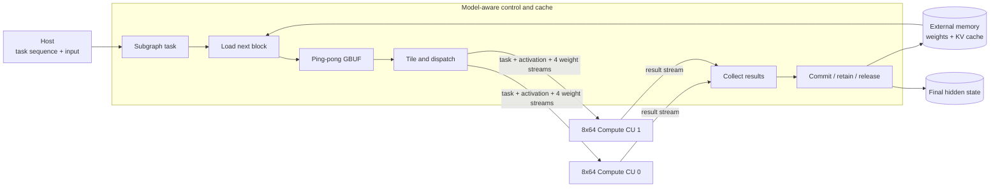
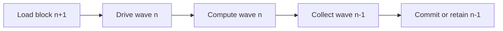

# LLM-ACCEL

**A streaming FPGA research prototype for resident LLM decoder execution.**

LLM-ACCEL studies how a model-aware controller and regular stream-only compute
arrays can execute transformer decoder subgraphs while keeping intermediate
tensors and KV state in accelerator memory. The current prototype implements Qwen-style RMSNorm,
Q/K/V/O projections, RoPE, an HBM-resident KV cache, online attention, gated
FFN, and residual paths using fixed-point arithmetic.

The central research question is:

> How much of an LLM decoder layer can be expressed as a static, overlapped
> hardware schedule while keeping the compute kernels simple, reusable, and
> efficiently utilized across decode and prefill shapes?

The repository contains synthesizable HLS kernels, closed-loop RTL
co-simulation tests, a multi-kernel Vitis integration, and reproducible
hardware-emulation experiments. Generated binaries, model weights, and tool
build directories are intentionally excluded.

## Research contributions

- **Model-aware control, model-agnostic compute.** A controller owns tensor
  residency, HBM traffic, KV-cache state, attention state, and wave scheduling;
  two identical 8x64 compute units execute matrix and vector tasks.
- **Block-level streaming ABI.** Cross-kernel traffic uses explicitly packed
  fixed-width words instead of bit-level pipelines or C++ structs, reducing
  control fan-out and making the physical interface regular.
- **Five-stage overlapped execution.** Block load, stream drive, compute,
  result collection, and commit/residency are connected by bounded FIFOs and
  cross-wave dataflow.
- **Online attention.** QK, running maximum, normalization sum, and PV
  accumulation are processed tile by tile; the full score matrix is never
  materialized off chip.
- **Controller-resident block prefill.** The same Task-18/19/20 contract accepts
  one to eight consecutive query rows, applies causal RoPE/KV/online attention
  per row, and keeps the block resident across decoder layers.
- **Shape-aware evaluation.** Decode reports both physical-array utilization
  and utilization normalized to its single active token row. Prefill evaluates
  how one 8-row prefill block fills the complete datapath.

## Architecture at a glance



Each compute CU sustains up to 512 MAC/cycle; the two-CU peak is
1024 MAC/cycle. Compute CUs have no external-memory master and do not encode
model semantics. This separation lets scheduling and memory policy evolve
without duplicating the arithmetic datapath.

The intended steady-state pipeline is:



See [Architecture](docs/architecture.md) for the execution model and
[Design Space](docs/design-space.md) for alternatives and trade-offs.

## Measurement vocabulary and execution boundary

`Active query rows / block` is the number of consecutive positions from one
sequence that occupy the 8-row compute datapath in one controller invocation.
It is not batch size and it is not the total request length. Prefill uses up to
eight active rows per block, so a 1024-token prompt contains 128 P8 blocks;
autoregressive decode has one active query row per forward. Workload labels such
as `P8+P8` describe the complete sequence of blocks included in that measured
case. In generation labels, `P<N>/G<M>` instead denotes a total N-token prompt
and M sampled tokens; for example, `P16/G1` traverses two 8-row prompt blocks.

Unless explicitly labeled CSim, RTL CoSim, or HLS synthesis, cycle and
efficiency results in this repository come from Vitis 2022.2 HW Emu CU traces.
They exclude simulator wall time, CPU golden-reference work, and Host scheduling
gaps, and they are not physical-board measurements.

In the current generation runtime, the Host prepares the input embedding,
submits coarse Task-18/19/20 commands, and performs the final LM-head
argmax/sampling. Transformer decoder arithmetic, final normalization,
intermediate hidden-state residency, RoPE, online attention, and KV-cache
updates execute through the controller and compute CUs. CPU fixed-point
arithmetic is used only as an out-of-band correctness oracle and is never
counted as accelerator work.

## Key results

### Standard controller-resident P8 layer

The release configuration executes one standard Qwen-shaped decoder layer as
three Host-visible coarse tasks while the controller owns all intermediate
hidden tensors, RoPE, online attention, and KV-cache state. The deterministic
random-weight P8 HW-Emu gate passes all 16,384 final-hidden values with maximum
raw error zero and no intermediate Host copy.

| Scope | Active query rows / block | Tasks | Cycles at 200 MHz | Latency | Useful GMAC/s | Physical efficiency |
| --- | ---: | ---: | ---: | ---: | ---: | ---: |
| Task 18 -> Task 19 -> Task 20 | 8 | 3 | 651,621 | 3.258 ms | 189.285 | 92.424% |

The row comes from the common run-local Vitis 2022.2 HW-Emu CU interval for the
controller, two compute CUs, and status sink. It excludes simulator wall time,
Host task gaps, setup/migration, and the CPU oracle. It is a standard
single-layer accelerator measurement, not a 36-layer end-to-end or physical
board result. Raw evidence and artifact identities are published in the
[Q2.14 release artifact](results/q214-resident-fix-20260818/).

### Operator-level Q2.14 diagnostic

The P/D table below is from the earlier **host-orchestrated, operator-level**
diagnostic path. All eight rows are Vitis 2022.2 hardware-emulation results;
they are neither coarse-task end-to-end measurements nor physical-board
measurements. The standard layer shape is
`hidden=2048`, `intermediate=11008`, 16 query heads, 2 KV heads, and
head dimension 128.

| Phase | KV context | Active query rows / block | Cycles at 200 MHz | Latency | Useful GMAC/s | Physical efficiency |
| --- | ---: | ---: | ---: | ---: | ---: | ---: |
| Prefill | 64 | 8 | 637,103 | 3.186 ms | 194.17 | 94.81% |
| Prefill | 256 | 8 | 685,489 | 3.427 ms | 182.30 | 89.02% |
| Prefill | 512 | 8 | 749,407 | 3.747 ms | 168.99 | 82.52% |
| Prefill | 1024 | 8 | 877,846 | 4.389 ms | 148.09 | 72.31% |
| Decode | 64 | 1 | 568,040 | 2.840 ms | 27.23 | 13.30% |
| Decode | 256 | 1 | 590,794 | 2.954 ms | 26.45 | 12.91% |
| Decode | 512 | 1 | 622,231 | 3.111 ms | 25.45 | 12.43% |
| Decode | 1024 | 1 | 683,754 | 3.419 ms | 23.77 | 11.61% |

`Active query rows / block = 8` means one full 8-row prefill block from one
sequence. It does not assert that the complete prompt contains only eight
tokens, and it does not mean eight sequences or eight decoded outputs. P1024
measures positions 1016--1023 against a causal history of up to
1024 KV entries. A full 1024-token prefill requires 128 context-dependent
blocks and is not represented by the P1024 latency alone.

These are Vitis 2022.2 hardware-emulation results at a modeled 200 MHz. They
sum kernel-active intervals for the host-submitted hardware operators that
compose a layer. Host scheduling gaps, transfers between calls, CPU test
fixture work, and CPU golden checks are excluded. See the
[full report](docs/q214-pd-length-hwemu.md) and
[raw profiles](results/q214-pd-20260811/).

The Q2.14 sweep validates functional composition and long-context scaling, but
the host still sequences operators, applies RoPE, and prepares the KV test
fixture. Main dense, attention, vector, and FFN arithmetic runs in the FPGA;
CPU golden arithmetic is validation-only and is excluded from the measured
interval.

### Controller-resident coarse-task validation

The new coarse-task
runtime implements the production boundary separately: Task 18 owns the full
attention sublayer including RoPE and KV update, Task 19 owns the FFN sublayer,
and Task 20 owns final RMSNorm. Hidden state remains in HBM across tasks and
layers; Norm/RoPE tables are initialized once as persistent model state, and
the host reads status records until the final output migration.

The original two-layer small-profile HW-Emu contract runs five tasks and
passes all 64 final-hidden values exactly with `intermediate_host_copy=0`.
The block extension passes an 8-row Task-18/19/20 HW-Emu check over 512 values
(maximum raw error 10 within tolerance 32) and a two-layer P8+G2 composition
with controller-owned KV and no intermediate host copy. Closed-loop block RTL
CoSim passes in 25,591 cycles with deadlock detection enabled. These are
small-shape protocol results; standard Qwen-layer performance is kept
separate in the [block-prefill artifact](results/block-prefill-20260817/).
The stronger two-layer P8 stack gate also passes 512 values (maximum raw error
10 within tolerance 64) across five coarse tasks with no intermediate Host
copy. Its run-local CU interval is 55,696.5 XSim cycles.
An exact P16 HW-Emu gate passes two consecutive 8-row blocks through both
layers, releases the first block without Task 20 or D2H, materializes only the
second block, and passes all 512 tail values against the cross-block CPU golden
(maximum raw error 10 within tolerance 64). A separate P16/G1 generation run
and a P11/G1 tail-block run also pass, confirming controller-owned KV progress
and that eight is a maximum query-block height rather than a fixed batch size.
The standard Qwen-layer P8 gate also completes Task 18/19/20 with exactly
16,384/16,384 final-hidden values correct, maximum raw error zero, and a
651,621-cycle common CU interval at the modeled 200-MHz clock.

## Decoder schedule

```text
RMSNorm
  -> Q/K/V projection -> RoPE -> append/read KV cache
  -> tiled QK -> online normalization -> tiled PV
  -> O projection -> residual
  -> RMSNorm
  -> Gate + Up -> SiLU multiply -> Down -> residual
```

Intermediate tensors can be committed to memory, retained in on-chip storage,
or released according to the task policy. The host is not part of the intended
inner-layer schedule. In the current end-to-end host path, software retains
embedding and LM-head/sampling, while the decoder stack, final normalization,
hidden residency, and KV-cache updates use coarse accelerator tasks.

## Repository map

| Path | Purpose |
| --- | --- |
| `kernel/` | Case 1: Controller, unified compute core, status sink, closed-loop wrappers |
| `include/` | Case 1: Model profiles, fixed-point types, packet ABI, pipeline parameters |
| `host/` | Case 1: XRT host, deterministic random-model generation, CPU golden checks |
| `tests/` | Case 1: Focused CSim and closed-loop C/RTL CoSim testbenches |
| `tcl/` | Case 1: Vitis HLS simulation, synthesis, CoSim, XO export flows |
| `scripts/` | Case 1: Reproducible long-running HLS and hardware-emulation entry points |
| `results/` | Versioned derived tables and raw kernel profiles for published experiments |
| `cases/streaming-split/` | **Case 2**: Streaming split architecture (cc + V8-2_s, D=16 + 4-PC weight) |
| `docs/` | Architecture, design alternatives, usage, and experimental evidence |

## Reproduce the core validation

The reference flow uses Ubuntu 20.04 and Vitis/Vivado/Vitis HLS/XRT 2022.2.
The implementation platform used for integration experiments is an Alveo U50,
but the research documents describe the architecture independently of board
bring-up details.

```bash
export VITIS_ENV_SCRIPT=/path/to/vitis_env_22.sh

# Fast software discriminator for the exact Q2.14-to-PV payload semantics.
make test_q214_payload_golden

# Closed controller-compute loop; RTL deadlock detection remains enabled.
make hls_csim_closed_loop_8x64_resident_layer
scripts/run_hls_resident_layer_cosim.sh

# Three-command coarse-task closed loop with a source fingerprint guard.
make hls_csim_closed_loop_8x64_composed_layer
make hls_cosim_closed_loop_8x64_composed_layer

# Exact 8-row controller-resident block with finite-FIFO deadlock checking.
make hls_csim_closed_loop_8x64_resident_prefill_block
make hls_cosim_closed_loop_8x64_resident_prefill_block

# Build and run the resource-pruned resident-layer hardware emulation.
scripts/build_vitis_8x64_resident_layer_hwemu.sh all
scripts/build_vitis_8x64_resident_layer_hwemu.sh run

# Host-composed Attention+FFN or full profile stack plus final norm.
scripts/build_vitis_8x64_resident_layer_hwemu.sh run-composed

# Rebuild the release profile from exactly matched qwen-layer sources and run
# its full 8-row Task-18/19/20 numerical gate. The dedicated runner below
# enforces the same profile, bounds, and artifact identity under tmux.
VITIS_8X64_MODEL_PROFILE=qwen-layer \
CC8_RESIDENT_TOKEN_ROWS=8 \
VITIS_8X64_BUILD_EXACT_COMPUTE_XO=1 \
VITIS_8X64_RESIDENT_VARIANT_TAG=block_prefill_q214_resident_fix \
  scripts/build_vitis_8x64_resident_layer_hwemu.sh all
scripts/run_vitis_8x64_qwen_exact_p8_tmux.sh

# Small-profile protocol gates remain useful for fast cross-layer regression.
VITIS_8X64_MODEL_PROFILE=small \
CC8_RESIDENT_TOKEN_ROWS=8 \
VITIS_8X64_BUILD_EXACT_COMPUTE_XO=1 \
VITIS_8X64_RESIDENT_VARIANT_TAG=block_prefill_q214_resident_fix \
  scripts/build_vitis_8x64_resident_layer_hwemu.sh all
VITIS_8X64_MODEL_PROFILE=small \
CC8_RESIDENT_TOKEN_ROWS=8 \
VITIS_8X64_BUILD_EXACT_COMPUTE_XO=1 \
VITIS_8X64_RESIDENT_VARIANT_TAG=block_prefill_q214_resident_fix \
  scripts/build_vitis_8x64_resident_layer_hwemu.sh run-block-stack

# Build the long-context Q2.14 profile and run the P/D length sweep.
VITIS_8X64_MODEL_PROFILE=qwen-layer-long \
  CC8_PREFILL_VARIANT=q214exp18 \
  scripts/build_vitis_8x64_prefill_eval_hwemu.sh all
scripts/launch_vitis_8x64_pd_sweep_tmux.sh \
  --build-dir <generated-hw_emu-build> \
  --profile qwen-layer-long --seed 20260722

# Build profile-matched 2048-position XOs and launch the full
# Qwen2.5-3B-shape prompt=8/generated=2/layers=36 coarse-task gate.
scripts/run_vitis_8x64_qwen3b_e2e_build_tmux.sh all
scripts/run_vitis_8x64_qwen3b_e2e_hwemu_tmux.sh
```

The main pipeline parameters can be swept without editing source:

```bash
CC8_WEIGHT_TILE_FIFO_DEPTH=2 \
CC8_WEIGHT_TILE_LOAD_II=2 \
CC8_MM_WAVE_RESULT_FIFO_DEPTH=33 \
CC8_ENABLE_MM_CROSS_WAVE_DATAFLOW=1 \
scripts/run_hls_resident_layer_cosim.sh
```

See [Usage and Reproduction](docs/usage.md) for build targets, model profiles,
prefill evaluation, expected outputs, and artifact locations.

## Documentation

- [Architecture](docs/architecture.md): system decomposition, dataflow,
  packet ABI, resident state, attention implementation, and **case studies**
  (Case 1 resident closed-loop + Case 2 streaming split).
- [Design Space](docs/design-space.md): candidate architectures, measured
  trade-offs, rejected approaches, and open research directions.
- [Usage and Reproduction](docs/usage.md): environment, HLS/RTL/Vitis flows,
  configuration parameters, and result inspection.
- [Experiments](docs/experiments.md): evidence levels, performance/resource
  tables, metric definitions, and limitations.
- [Q2.14 P/D sweep](docs/q214-pd-length-hwemu.md): context-length scaling,
  precision gates, measurement boundary, and raw-data provenance.
- [Coarse-task runtime](docs/coarse-task-runtime.md): Task 18/19/20 contract,
  HBM-resident composition, CoSim/HW-Emu evidence, and resource cost.
- [Block-prefill evidence](results/block-prefill-20260817/): exact 8-row CSim,
  RTL CoSim, HW-Emu profiles, and HLS resource summaries.
- [Controller-resident Q2.14 fix](results/q214-resident-fix-20260818/):
  bit-accurate probability/PV transport, finite-buffer CoSim, focused P2/P8
  HW-Emu diagnostics, the standard P8 three-task result, and release-bound
  artifact identities.
- **Case 2**: [`cases/streaming-split/`](cases/streaming-split/) — streaming
  split architecture with `operator_program` scheduling, INPUT_DIM=16,
  4-PC weight multi-bank, and an analytical ~50 token/s decode projection
  from its HLS schedule. See
  [design](cases/streaming-split/docs/design.md).

## Scope

The standard performance artifact remains a single-layer fixed-point research
prototype. Its Q2.14 P/D numbers are kernel-only, host-orchestrated diagnostic
profiles. The coarse-task runtime executes controller-resident subgraphs and
now supports multi-row block prefill plus one-row decode while proving
cross-task/cross-layer hidden and KV residency. It does not yet claim
checkpoint-level 36-layer accuracy, accelerator-side LM-head/sampling,
PCIe-inclusive physical latency, or physical-board performance.

## Citation

If this repository contributes to a publication, please cite it using the
metadata in [`CITATION.cff`](CITATION.cff), or use:

```bibtex
@software{truncat3_llm_accel_2026,
  author       = {TruNcat3},
  title        = {LLM-ACCEL: A Streaming FPGA Research Prototype for Resident LLM Decoder Execution},
  year         = {2026},
  url          = {https://github.com/TruNcat3/LLM-ACCEL},
  note         = {Source code and reproducible HLS/RTL hardware-emulation experiments}
}
```
