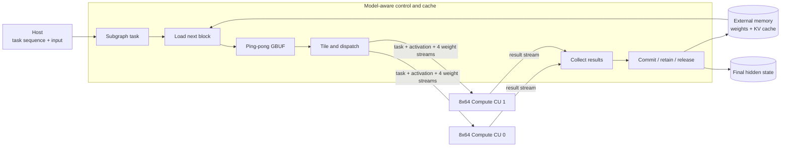
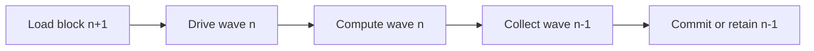

# LLM-ACCEL

**A streaming FPGA research prototype for resident LLM decoder execution.**

LLM-ACCEL studies how a model-aware controller and regular stream-only compute
arrays can execute transformer decoder subgraphs while keeping intermediate
tensors and KV state in accelerator memory. The current prototype implements Qwen-style RMSNorm,
Q/K/V/O projections, RoPE, an HBM-resident KV cache, online attention, gated
FFN, and residual paths using fixed-point arithmetic.

The central research question is:

> How much of an LLM decoder layer can be expressed as a static, overlapped
> hardware schedule while keeping the compute kernels simple, reusable, and
> efficiently utilized across decode and prefill shapes?

The repository contains synthesizable HLS kernels, closed-loop RTL
co-simulation tests, a multi-kernel Vitis integration, and reproducible
hardware-emulation experiments. Generated binaries, model weights, and tool
build directories are intentionally excluded.

## Research contributions

- **Model-aware control, model-agnostic compute.** A controller owns tensor
  residency, HBM traffic, KV-cache state, attention state, and wave scheduling;
  two identical 8x64 compute units execute matrix and vector tasks.
- **Block-level streaming ABI.** Cross-kernel traffic uses explicitly packed
  fixed-width words instead of bit-level pipelines or C++ structs, reducing
  control fan-out and making the physical interface regular.
- **Five-stage overlapped execution.** Block load, stream drive, compute,
  result collection, and commit/residency are connected by bounded FIFOs and
  cross-wave dataflow.
- **Online attention.** QK, running maximum, normalization sum, and PV
  accumulation are processed tile by tile; the full score matrix is never
  materialized off chip.
- **Shape-aware evaluation.** Decode reports both physical-array utilization
  and utilization normalized to its single active token row. Prefill evaluates
  how an 8-token block fills the complete 8-row datapath.

## Architecture at a glance



Each compute CU sustains up to 512 MAC/cycle; the two-CU peak is
1024 MAC/cycle. Compute CUs have no external-memory master and do not encode
model semantics. This separation lets scheduling and memory policy evolve
without duplicating the arithmetic datapath.

The intended steady-state pipeline is:



See [Architecture](docs/architecture.md) for the execution model and
[Design Space](docs/design-space.md) for alternatives and trade-offs.

## Key results

All measurements below are from Vitis HLS or RTL hardware emulation. They are
not physical-board measurements. The standard layer shape is
`hidden=2048`, `intermediate=11008`, 16 query heads, 2 KV heads, and
head dimension 128.

| Phase | KV context | Active query tokens | Cycles at 200 MHz | Latency | Useful GMAC/s | Physical efficiency |
| --- | ---: | ---: | ---: | ---: | ---: | ---: |
| Prefill | 64 | 8 | 637,103 | 3.186 ms | 194.17 | 94.81% |
| Prefill | 256 | 8 | 685,489 | 3.427 ms | 182.30 | 89.02% |
| Prefill | 512 | 8 | 749,407 | 3.747 ms | 168.99 | 82.52% |
| Prefill | 1024 | 8 | 877,846 | 4.389 ms | 148.09 | 72.31% |
| Decode | 64 | 1 | 568,040 | 2.840 ms | 27.23 | 13.30% |
| Decode | 256 | 1 | 590,794 | 2.954 ms | 26.45 | 12.91% |
| Decode | 512 | 1 | 622,231 | 3.111 ms | 25.45 | 12.43% |
| Decode | 1024 | 1 | 683,754 | 3.419 ms | 23.77 | 11.61% |

`Active query tokens=8` means one full 8-row prefill block, not an eight-token
prompt. P1024 measures positions 1016--1023 against a causal history of up to
1024 KV entries. A full 1024-token prefill requires 128 context-dependent
blocks and is not represented by the P1024 latency alone.

These are Vitis 2022.2 hardware-emulation results at a modeled 200 MHz. They
sum kernel-active intervals for the host-submitted hardware operators that
compose a layer. Host scheduling gaps, transfers between calls, CPU test
fixture work, and CPU golden checks are excluded. See the
[full report](docs/q214-pd-length-hwemu.md) and
[raw profiles](results/q214-pd-20260811/).

The Q2.14 sweep validates functional composition and long-context scaling, but
it is not yet an autonomous single-launch layer. The current host sequences
operator tasks, performs RoPE/test-fixture packing, and preloads the historical
KV fixture. The next implementation step is to turn useful operator groups
into controller-resident subgraph tasks while retaining host-level task
composition for end-to-end inference.

## Decoder schedule

```text
RMSNorm
  -> Q/K/V projection -> RoPE -> append/read KV cache
  -> tiled QK -> online normalization -> tiled PV
  -> O projection -> residual
  -> RMSNorm
  -> Gate + Up -> SiLU multiply -> Down -> residual
```

Intermediate tensors can be committed to memory, retained in on-chip storage,
or released according to the task policy. The host is not part of the intended
inner-layer schedule.

## Repository map

| Path | Purpose |
| --- | --- |
| `kernel/` | Case 1: Controller, unified compute core, status sink, closed-loop wrappers |
| `include/` | Case 1: Model profiles, fixed-point types, packet ABI, pipeline parameters |
| `host/` | Case 1: XRT host, deterministic random-model generation, CPU golden checks |
| `tests/` | Case 1: Focused CSim and closed-loop C/RTL CoSim testbenches |
| `tcl/` | Case 1: Vitis HLS simulation, synthesis, CoSim, XO export flows |
| `scripts/` | Case 1: Reproducible long-running HLS and hardware-emulation entry points |
| `results/` | Versioned derived tables and raw kernel profiles for published experiments |
| `cases/streaming-split/` | **Case 2**: Streaming split architecture (cc + V8-2_s, D=16 + 4-PC weight) |
| `docs/` | Architecture, design alternatives, usage, and experimental evidence |

## Reproduce the core validation

The reference flow uses Ubuntu 20.04 and Vitis/Vivado/Vitis HLS/XRT 2022.2.
The implementation platform used for integration experiments is an Alveo U50,
but the research documents describe the architecture independently of board
bring-up details.

```bash
export VITIS_ENV_SCRIPT=/path/to/vitis_env_22.sh

# Closed controller-compute loop; RTL deadlock detection remains enabled.
make hls_csim_closed_loop_8x64_resident_layer
scripts/run_hls_resident_layer_cosim.sh

# Build and run the resource-pruned resident-layer hardware emulation.
scripts/build_vitis_8x64_resident_layer_hwemu.sh all
scripts/build_vitis_8x64_resident_layer_hwemu.sh run

# Build the long-context Q2.14 profile and run the P/D length sweep.
VITIS_8X64_MODEL_PROFILE=qwen-layer-long \
  CC8_PREFILL_VARIANT=q214exp18 \
  scripts/build_vitis_8x64_prefill_eval_hwemu.sh all
scripts/launch_vitis_8x64_pd_sweep_tmux.sh \
  --build-dir <generated-hw_emu-build> \
  --profile qwen-layer-long --seed 20260722
```

The main pipeline parameters can be swept without editing source:

```bash
CC8_WEIGHT_TILE_FIFO_DEPTH=2 \
CC8_WEIGHT_TILE_LOAD_II=2 \
CC8_MM_WAVE_RESULT_FIFO_DEPTH=33 \
CC8_ENABLE_MM_CROSS_WAVE_DATAFLOW=1 \
scripts/run_hls_resident_layer_cosim.sh
```

See [Usage and Reproduction](docs/usage.md) for build targets, model profiles,
prefill evaluation, expected outputs, and artifact locations.

## Documentation

- [Architecture](docs/architecture.md): system decomposition, dataflow,
  packet ABI, resident state, attention implementation, and **case studies**
  (Case 1 resident closed-loop + Case 2 streaming split).
- [Design Space](docs/design-space.md): candidate architectures, measured
  trade-offs, rejected approaches, and open research directions.
- [Usage and Reproduction](docs/usage.md): environment, HLS/RTL/Vitis flows,
  configuration parameters, and result inspection.
- [Experiments](docs/experiments.md): evidence levels, performance/resource
  tables, metric definitions, and limitations.
- [Q2.14 P/D sweep](docs/q214-pd-length-hwemu.md): context-length scaling,
  precision gates, measurement boundary, and raw-data provenance.
- **Case 2**: [`cases/streaming-split/`](cases/streaming-split/) — streaming
  split architecture with `operator_program` scheduling, INPUT_DIM=16,
  4-PC weight multi-bank, ~50 token/s decode (csynth). See
  [design](cases/streaming-split/docs/design.md).

## Scope

The current artifact is a single-layer fixed-point research prototype. Its
published P/D numbers are kernel-only, host-orchestrated layer profiles. It
does not yet claim autonomous end-to-end checkpoint inference,
LM-head/sampling performance, PCIe-inclusive latency, or physical-board
performance. The target runtime submits a sequence of coarse compute tasks;
each task lets the controller autonomously execute a resident subgraph while
owning intermediate tensors and KV cache in HBM/on-chip buffers.

## Citation

If this repository contributes to a publication, please cite it using the
metadata in [`CITATION.cff`](CITATION.cff), or use:

```bibtex
@software{truncat3_llm_accel_2026,
  author       = {TruNcat3},
  title        = {LLM-ACCEL: A Streaming FPGA Research Prototype for Resident LLM Decoder Execution},
  year         = {2026},
  url          = {https://github.com/TruNcat3/LLM-ACCEL},
  note         = {Source code and reproducible HLS/RTL hardware-emulation experiments}
}
```
