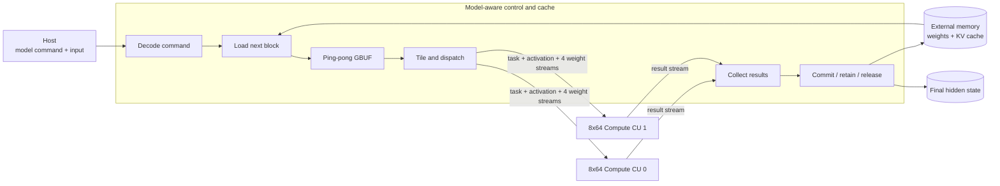
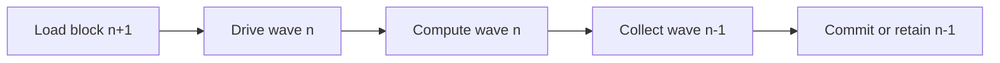

# LLM-ACCEL

**A streaming FPGA research prototype for resident LLM decoder execution.**

LLM-ACCEL studies how a model-aware controller and regular stream-only compute
arrays can execute transformer decoder layers without returning intermediate
tensors to the host. The current prototype implements Qwen-style RMSNorm,
Q/K/V/O projections, RoPE, an HBM-resident KV cache, online attention, gated
FFN, and residual paths using fixed-point arithmetic.

The central research question is:

> How much of an LLM decoder layer can be expressed as a static, overlapped
> hardware schedule while keeping the compute kernels simple, reusable, and
> efficiently utilized across decode and prefill shapes?

The repository contains synthesizable HLS kernels, closed-loop RTL
co-simulation tests, a multi-kernel Vitis integration, and reproducible
hardware-emulation experiments. Generated binaries, model weights, and tool
build directories are intentionally excluded.

## Research contributions

- **Model-aware control, model-agnostic compute.** A controller owns tensor
  residency, HBM traffic, KV-cache state, attention state, and wave scheduling;
  two identical 8x64 compute units execute matrix and vector tasks.
- **Block-level streaming ABI.** Cross-kernel traffic uses explicitly packed
  fixed-width words instead of bit-level pipelines or C++ structs, reducing
  control fan-out and making the physical interface regular.
- **Five-stage overlapped execution.** Block load, stream drive, compute,
  result collection, and commit/residency are connected by bounded FIFOs and
  cross-wave dataflow.
- **Online attention.** QK, running maximum, normalization sum, and PV
  accumulation are processed tile by tile; the full score matrix is never
  materialized off chip.
- **Shape-aware evaluation.** Decode reports both physical-array utilization
  and utilization normalized to its single active token row. Prefill evaluates
  how an 8-token block fills the complete 8-row datapath.

## Architecture at a glance



Each compute CU sustains up to 512 MAC/cycle; the two-CU peak is
1024 MAC/cycle. Compute CUs have no external-memory master and do not encode
model semantics. This separation lets scheduling and memory policy evolve
without duplicating the arithmetic datapath.

The intended steady-state pipeline is:



See [Architecture](docs/architecture.md) for the execution model and
[Design Space](docs/design-space.md) for alternatives and trade-offs.

## Key results

All measurements below are from Vitis HLS or RTL hardware emulation. They are
not physical-board measurements. The standard layer shape is
`hidden=2048`, `intermediate=11008`, 16 query heads, 2 KV heads, and
head dimension 128.

| Experiment | Main result | Interpretation |
| --- | ---: | --- |
| 8-token prefill layer | 635,399 cycles at 200 MHz | Complete Q/K/V/O, causal attention for positions 0-7, and FFN pass |
| Prefill throughput | **194.12 GMAC/s** | 94.78% of the two-CU 204.8 GMAC/s peak |
| 2-token to 8-token scaling | **3.53x throughput** | Work grows by about 4x while active time grows by 13.2% |
| Single-token resident layer | 683,601 cycles | 3.418 ms when projected to 200 MHz |
| Decode utilization | 11.01% physical / **88.09% row-normalized** | Most physical loss is the M=1 shape, not pipeline starvation |
| Full O projection | 46,898 cycles | 69.87% array efficiency; later waves average 2,210 cycles vs. 2,048 ideal |
| Closed-loop RTL CoSim | 6,129 cycles, PASS | Bounded streams with deadlock detection enabled |

The 8-token result is a diagnostic full-profile build used to expose every
operator to the test host. Its datapath is efficient, but its controller keeps
mutually exclusive diagnostic paths and therefore exceeds the target device's
resource budget. The deployable research direction is to preserve this
datapath while compiling prefill into the resource-pruned resident schedule.
This distinction, resource tables, and metric definitions are documented in
[Experiments](docs/experiments.md).

## Decoder schedule

```text
RMSNorm
  -> Q/K/V projection -> RoPE -> append/read KV cache
  -> tiled QK -> online normalization -> tiled PV
  -> O projection -> residual
  -> RMSNorm
  -> Gate + Up -> SiLU multiply -> Down -> residual
```

Intermediate tensors can be committed to memory, retained in on-chip storage,
or released according to the task policy. The host is not part of the intended
inner-layer schedule.

## Repository map

| Path | Purpose |
| --- | --- |
| `kernel/` | Controller, unified compute core, status sink, and closed-loop wrappers |
| `include/` | Model profiles, fixed-point types, packet ABI, and pipeline parameters |
| `host/` | XRT host, deterministic random-model generation, and CPU golden checks |
| `tests/` | Focused CSim and closed-loop C/RTL CoSim testbenches |
| `tcl/` | Vitis HLS simulation, synthesis, CoSim, and XO export flows |
| `scripts/` | Reproducible long-running HLS and hardware-emulation entry points |
| `docs/` | Architecture, design alternatives, usage, and experimental evidence |

## Reproduce the core validation

The reference flow uses Ubuntu 20.04 and Vitis/Vivado/Vitis HLS/XRT 2022.2.
The implementation platform used for integration experiments is an Alveo U50,
but the research documents describe the architecture independently of board
bring-up details.

```bash
export VITIS_ENV_SCRIPT=/path/to/vitis_env_22.sh

# Closed controller-compute loop; RTL deadlock detection remains enabled.
make hls_csim_closed_loop_8x64_resident_layer
scripts/run_hls_resident_layer_cosim.sh

# Build and run the resource-pruned resident-layer hardware emulation.
scripts/build_vitis_8x64_resident_layer_hwemu.sh all
scripts/build_vitis_8x64_resident_layer_hwemu.sh run
```

The main pipeline parameters can be swept without editing source:

```bash
CC8_WEIGHT_TILE_FIFO_DEPTH=2 \
CC8_WEIGHT_TILE_LOAD_II=2 \
CC8_MM_WAVE_RESULT_FIFO_DEPTH=33 \
CC8_ENABLE_MM_CROSS_WAVE_DATAFLOW=1 \
scripts/run_hls_resident_layer_cosim.sh
```

See [Usage and Reproduction](docs/usage.md) for build targets, model profiles,
prefill evaluation, expected outputs, and artifact locations.

## Documentation

- [Architecture](docs/architecture.md): system decomposition, dataflow,
  packet ABI, resident state, and attention implementation.
- [Design Space](docs/design-space.md): candidate architectures, measured
  trade-offs, rejected approaches, and open research directions.
- [Usage and Reproduction](docs/usage.md): environment, HLS/RTL/Vitis flows,
  configuration parameters, and result inspection.
- [Experiments](docs/experiments.md): evidence levels, performance/resource
  tables, metric definitions, and limitations.

## Scope

The current artifact is a single-layer fixed-point research prototype. It does
not yet claim end-to-end checkpoint accuracy, long-context prefill throughput,
LM-head/sampling performance, or physical-board performance. Those are
evaluation milestones, not prerequisites for studying the controller/compute
decomposition and streaming schedule implemented here.

## Citation

If this repository contributes to a publication, please cite it using the
metadata in [`CITATION.cff`](CITATION.cff), or use:

```bibtex
@software{truncat3_llm_accel_2026,
  author       = {TruNcat3},
  title        = {LLM-ACCEL: A Streaming FPGA Research Prototype for Resident LLM Decoder Execution},
  year         = {2026},
  url          = {https://github.com/TruNcat3/LLM-ACCEL},
  note         = {Source code and reproducible HLS/RTL hardware-emulation experiments}
}
```
