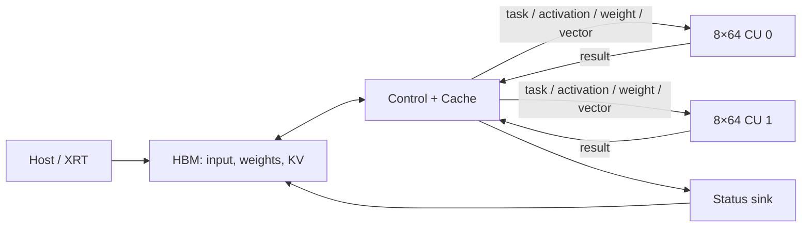

# LLM-ACCEL：双 8×64 Qwen FPGA 加速器

本项目面向 Xilinx Alveo U50，使用一个控制/缓存核、两个统一 8×64 计算核和一个状态核执行 Qwen decoder。当前版本的重点是让完整 decoder layer 驻留在设备侧：Host 只下发操作类型、模型参数、输入和地址，控制核负责 HBM/KV Cache、算子拆解、分波调度与在线 Softmax，计算核执行矩阵和向量数据通路。

详细设计见 [架构设计](docs/架构设计.md)，当前验证结果与性能数据见 [当前版本与验证](docs/当前版本与验证.md)。

## 当前状态

- Qwen2.5-3B 单层标准形状：hidden 2048、intermediate 11008、16 个 Q head、2 个 KV head、head dim 128。
- 跨 kernel 接口采用块级定宽包：task 160 bit、activation 128 bit、weight 256 bit、vector/result 416 bit、status 64 bit。
- 控制核实现片上大块缓存、按 8×64 tile 分 wave、双缓存和跨 wave DATAFLOW，使 HBM load、stream 驱动、结果收集与提交重叠。
- RoPE、KV Cache 管理以及在线 Softmax/FlashAttention 均在设备侧完成，不经过 PCIe 回传中间结果。
- resident-layer CSim 与开启死锁检测的 C/RTL CoSim 已通过；完整随机权重 decoder layer 的 hw_emu 已通过，2048 个输出逐位一致。
- 标准尺寸 8-token prefill 诊断版本已完成 hw_emu：Q/K/V、position 0..7 causal FlashAttention、O、Gate/Up/Down 与向量通路全部通过；总活跃区间约 635,399 cycles，双 CU 有效利用率 94.78%。该全 profile controller 的 HLS 资源仍超过 U50，性能通路需要收敛到精简的 resident 静态调度后才能部署。
- 当前 `.cw1` hw_emu 记录约 683,601 cycles/layer，比未重叠基线 714,495 cycles 降低 4.32%。按 200 MHz 时钟模型折算约 3.418 ms/layer、22.55 GMAC/s。
- 真实 U50 上板验证暂缓：本机板卡 SC firmware 未进入 ready 状态，这不是 kernel 功能失败。公开仓库不包含生成的 XO、xclbin、日志或模型权重。

## 系统结构



每个计算核峰值为 512 MAC/cycle。计算核不直接访问 HBM；所有片外数据、KV Cache 和模型执行状态由控制核管理。

## 项目结构

| 路径 | 内容 |
| --- | --- |
| `include/` | 数据类型、模型配置、stream ABI 与流水线超参 |
| `kernel/` | 控制核、统一计算核、状态核及闭环 CoSim wrapper |
| `tests/` | CSim/Cosim testbench 与 resident 数据结构单元测试 |
| `tcl/` | Vitis HLS CSim、综合、CoSim 和 XO 导出入口 |
| `host/` | XRT smoke host 与模型级/随机权重 host |
| `scripts/` | HLS、resident-layer hw_emu 和系统构建脚本 |
| `conn_u50_8x64_dual*.cfg` | 多 kernel stream 连接与 U50 HBM 映射 |

## 环境

- Ubuntu 20.04；
- Vitis、Vivado、Vitis HLS 2022.2；
- XRT 2022.2；
- Alveo U50 平台 `xilinx_u50_gen3x16_xdma_5_202210_1`。

脚本默认加载 `/home/hepc/env/vitis_env_22.sh`，其他环境可覆盖：

```bash
export VITIS_ENV_SCRIPT=/path/to/vitis_env_22.sh
```

## 快速验证

### 1. 闭环 resident-layer CSim/CoSim

以下流程把 controller、两个 compute 数据通路和 status sink 放进同一 HLS 闭环。CoSim 默认开启死锁检测：

```bash
make hls_csim_closed_loop_8x64_resident_layer
scripts/run_hls_resident_layer_cosim.sh
```

关键超参可通过环境变量覆盖：

```bash
CC8_WEIGHT_TILE_FIFO_DEPTH=2 \
CC8_WEIGHT_TILE_LOAD_II=2 \
CC8_ENABLE_MM_CROSS_WAVE_DATAFLOW=1 \
CC8_MM_WAVE_RESULT_FIFO_DEPTH=33 \
scripts/run_hls_resident_layer_cosim.sh
```

### 2. 构建 resident-layer hw_emu

脚本将输出放入带 profile 与流水线参数的独立目录，不覆盖其他实验：

```bash
scripts/build_vitis_8x64_resident_layer_hwemu.sh all
scripts/build_vitis_8x64_resident_layer_hwemu.sh run
```

也可分阶段执行：

```bash
scripts/build_vitis_8x64_resident_layer_hwemu.sh control-xo
scripts/build_vitis_8x64_resident_layer_hwemu.sh status-xo
scripts/build_vitis_8x64_resident_layer_hwemu.sh link
scripts/build_vitis_8x64_resident_layer_hwemu.sh host
```

### 3. 通用多 kernel 流程

```bash
make vitis_8x64_xo VITIS_8X64_MODEL_PROFILE=qwen-layer
make vitis_8x64_link TARGET=hw_emu VITIS_8X64_MODEL_PROFILE=qwen-layer
make vitis_8x64_run_qwen TARGET=hw_emu VITIS_8X64_MODEL_PROFILE=qwen-layer \
  QWEN_ARGS="--mode verify-resident-layer --profile qwen-layer --random-model --seed 20260718 --position 0"
```

`small`、`medium`、`qwen-layer` 和 `qwen2.5-3b` 是 Makefile 支持的模型 profile。完整 3B 权重需要使用 `conn_u50_8x64_dual_full_resident.cfg` 的跨 HBM bank 映射。

正常尺寸 8-token prefill 使用保留分算子 profile 通路的 controller：

```bash
make vitis_8x64_xo TARGET=hw_emu FREQUENCY=200 \
  VITIS_8X64_MODEL_PROFILE=qwen-layer
make vitis_8x64_link vitis_8x64_qwen_host vitis_8x64_emconfig \
  TARGET=hw_emu FREQUENCY=200 VITIS_8X64_MODEL_PROFILE=qwen-layer
make vitis_8x64_run_qwen TARGET=hw_emu FREQUENCY=200 \
  VITIS_8X64_MODEL_PROFILE=qwen-layer RUN_TIMEOUT=604800 \
  QWEN_ARGS="--mode profile-prefill-block --profile qwen-layer --prefill-len 8 --random-model --seed 20260722"
```

标准尺寸 prefill 的测试口径、周期计算和限制见 [8-token Prefill hw_emu 性能](docs/8-token_Prefill_hw_emu性能_20260723.md)。

## 验证边界

hw_emu 的周期来自仿真时钟模型，可用于比较设计版本和定位流水停顿，但不等同于板上实测延迟。当前 prefill 测试覆盖一个 8-token block 和 position 0..7 的单 attention tile；完整多层 3B 模型、长上下文 prefill 和真实 U50 功耗/吞吐仍需后续验证。

## 生成物

`qwen_hls*_prj/`、`vitis_8x64/`、`reports/`、`logs/`、XO、xclbin、波形和模型权重均由 `.gitignore` 排除。仓库只维护源码、测试、构建入口和经过核对的结果摘要。
