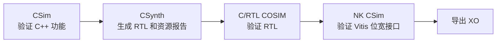
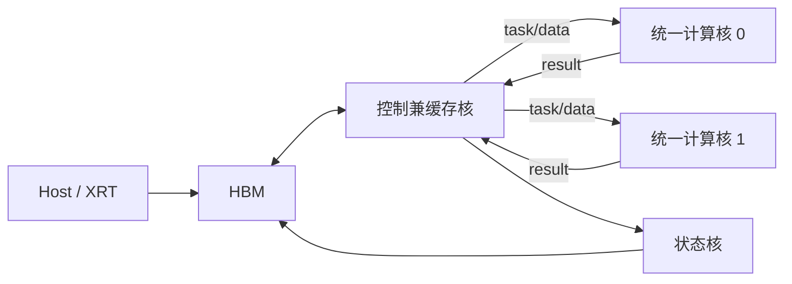

# LLM-FPGA 加速器设计

本项目面向 Xilinx Alveo U50，
执行 Qwen 类模型。计算核只处理 MM、Norm、Attention、非线性和向量运算；
模型算子、HBM 地址和多核调度由控制兼缓存核管理。

设计原理见 [docs/架构设计.md](docs/架构设计.md)。

## 开发流程

XRT 加速器开发分为三个相对独立的阶段：


1. **硬件结构设计与测试**：分别确认计算核和控制缓存核的算法、接口和 RTL。
2. **系统集成与 Host**：把多个核连接成完整加速器，并验证 XRT 调度与 HBM。
3. **板上验证**：生成硬件镜像，在 U50 上测量正确性、吞吐和带宽。

开发时应按这个顺序推进。前一阶段尚未稳定时，不应直接用完整系统定位问题。

## 项目结构

| 路径 | 内容 |
| --- | --- |
| `include/` | 数据类型、计算任务和 stream 接口 |
| `kernel/` | 计算核、控制缓存核及 Vitis wrapper |
| `tests/` | HLS 测试程序 |
| `tcl/` | HLS 工程入口 |
| `host/` | XRT smoke 测试和模型级调度 |
| `scripts/` | 后台综合、仿真和部署入口 |
| `conn_u50_8x64_dual.cfg` | 多核连接与 HBM 分配 |

## 环境

- Vitis、Vivado、Vitis HLS 2022.2；
- XRT；
- Alveo U50 平台 `xilinx_u50_gen3x16_xdma_5_202210_1`。

脚本默认加载 `/home/hepc/env/vitis_env_22.sh`。其他环境可覆盖：

```bash
export VITIS_ENV_SCRIPT=/path/to/vitis_env_22.sh
```

## 一、硬件结构设计与测试

这一阶段只研究单个硬件模块，不连接完整 XRT 系统。

### 1. 设计对象

#### 统一计算核

单个计算核包含：

- 一个每拍 512 MAC 的 8x64 MM 引擎；
- MM 结果缩放与 SiLU；
- RMSNorm、SiLU-Mul、Residual-Add 和 Softmax；
- task、activation、weight、vector 和 result stream。

#### 控制兼缓存核

控制核负责：

- 从 HBM 装载输入和权重；
- 管理片上 global buffer；
- 把模型算子转换为纯计算 task；
- 同时驱动两个计算核；
- 收集并写回计算结果。

### 2. HLS 验证顺序



#### CSim

CSim 用 CPU 执行 HLS C++，适合检查数值、边界和 stream 顺序：

```bash
make hls_csim_compute
make hls_csim_control
make hls_csim_nk
```

#### CSynth

CSynth 将模块转换为 RTL，用于观察 DSP/LUT/BRAM、流水 II 和估计延迟：

```bash
scripts/run_hls_csynth_compute_core_8x64_unified_nohup.sh
scripts/run_hls_csynth_control_cache_8x64_dual_core_nohup.sh
```

#### C/RTL COSIM

COSIM 使用同一测试程序驱动综合后的 RTL，检查数值与握手：

```bash
scripts/run_hls_cosim_compute_core_8x64_unified_nohup.sh
scripts/run_hls_cosim_control_cache_8x64_dual_core_nohup.sh
```

#### XO

XO 是交给 Vitis 系统集成的独立硬件模块：

```bash
scripts/run_vitis_8x64_xo_nohup.sh
```

生成：

```text
vitis_8x64/xo/compute_core_8x64_unified_nk.xo
vitis_8x64/xo/control_cache_8x64_dual_core_nk.xo
vitis_8x64/xo/cc8_status_sink_nk.xo
```

## 二、系统集成与 Host

这一阶段使用 `conn_u50_8x64_dual.cfg` 将一个控制核、两个计算核和一个状态核
连接成完整加速器。

### 1. 集成结构



计算核不直接访问 HBM。控制核负责片外数据、片上缓存和计算 stream 之间的转换。

### 2. 软件仿真

软件仿真用于检查 XRT 参数、buffer、kernel 名称和基本调度：

```bash
scripts/run_vitis_8x64_sw_emu.sh
```

它不运行真实 RTL，也不用于评估周期或性能。

### 3. 硬件仿真

硬件仿真使用链接后的 RTL，适合检查多核 stream、HBM 访问和系统级死锁：

```bash
scripts/run_vitis_8x64_hw_emu.sh
```

模型级调度：

```bash
make vitis_8x64_run_qwen TARGET=hw_emu
```

随机定点数测试：

```bash
make vitis_8x64_run_random TARGET=hw_emu
```

### 4. Host 分工

`host_8x64.cpp` 是接口 smoke 测试，覆盖基本 MM、向量算子和状态返回。

`host_qwen_8x64.cpp` 按 decoder 顺序组织：

```text
Embedding
  -> RMSNorm
  -> Q/K/V
  -> RoPE + KV
  -> QK + Softmax + PV
  -> O Projection + Residual
  -> RMSNorm
  -> Gate/Up + SiLU-Mul + Down
  -> Residual
  -> Final RMSNorm
  -> LM Head
```

当前 Host 承担模型级编排；加速器承担 MM、Attention、Norm、FFN 和向量计算。
未来的设备驻留式整网设计见架构文档中的“未来任务”。

## 三、板上验证

板上验证使用真实 U50，目标不再是证明单个函数，而是确认整个系统的物理实现和
运行表现。

### 1. 构建硬件镜像

```bash
TARGET=hw scripts/run_vitis_8x64_link_nohup.sh
```

Vitis 会完成：

```text
XO
  -> 多核连接
  -> HBM 映射
  -> Vivado 综合
  -> 布局布线
  -> xclbin
```

### 2. 运行板卡测试

接口 smoke：

```bash
scripts/run_vitis_8x64_hw.sh
```

模型级调度：

```bash
make vitis_8x64_run_qwen TARGET=hw
```

随机数正确性：

```bash
make vitis_8x64_run_random TARGET=hw
```

### 3. 验证顺序

建议依次检查：

1. kernel 能否启动和结束；
2. status、MM 和向量结果是否正确；
3. 连续 token 和多 layer 是否稳定；
4. HBM 与 stream 是否出现停顿；
5. 实际延迟、吞吐和功耗。

## 运行约定

- 后台任务的输出位于 `logs/`；
- HLS 与 Vitis 脚本要求至少 50 GiB 可用内存；
- 最多同时运行两个 HLS 工程；
- 不要让两个 TCL 同时修改同一个工程目录。

归档完整性可使用以下命令检查：

```bash
sha256sum -c CHECKSUMS.sha256
```
