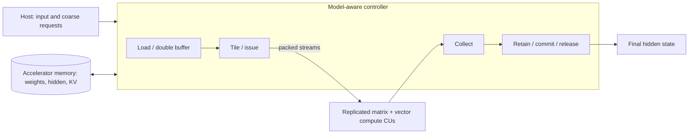
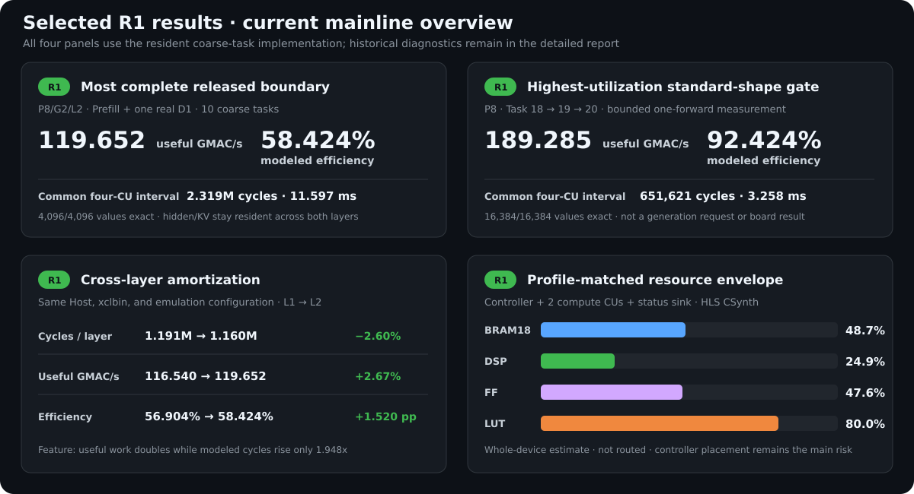

# CoWave

**Controller-Orchestrated Streaming for LLM Acceleration.**

CoWave separates model-aware scheduling from regular streaming compute arrays.
The controller keeps intermediate tensors and KV state in accelerator memory,
divides work into tiles, and overlaps data movement with matrix/vector execution.
This repository publishes the designs, reproducible experiments and their limits.

New to Vitis? Start with our [Vitis workflow tutorial](https://github.com/Reconfigurable-Computing/Vitis_workflow)
(in Chinese), then follow the [environment setup](docs/environment.md).

[Architecture](docs/architecture.md) · [Design catalog](docs/implementations.md) ·
[Design choices](docs/design-space.md) · [Evaluation](docs/experiments.md) ·
[Getting started](docs/usage.md) · [Citation](#citation)

Choose parameters with the [design-point generator](docs/usage.md#design-point-generator).
It resolves configurations, source/evidence links and reproducible commands from one catalog.

## Architecture


```mermaid
flowchart LR
    H[Host: input and coarse requests] --> C
    M[(Accelerator memory: weights, hidden, KV)] <--> C
    subgraph C[Model-aware controller]
        L[Load / double buffer] --> I[Tile / issue]
        R[Collect] --> S[Retain / commit / release]
    end
    I -->|packed streams| U[Replicated matrix + vector compute CUs]
    U --> R
    S --> O[Final hidden state]
```

The five stages are **load → issue → compute → collect → commit**. Banked
buffers and bounded streams allow adjacent waves to overlap; dependencies still
govern which transformer operations can run together. The controller owns
normalization, projection scheduling, RoPE, attention, FFN and KV updates.
Host responsibilities and integration boundaries are [specified per design](docs/architecture.md).

## Choose a design

Names expose the architecture: `cowave-<arithmetic>-<compute CUs>-<rows>-<columns>`.
For example, `cowave-int4-4-8-128` has four compute CUs with an 8×128 logical
array each. Rows describe the physical tile, not prompt length or sequence batch.

| Design | Distinctive feature | Source and reproduction |
| --- | --- | --- |
| **`cowave-fix16-2-8-64`** | Resident decoder and multi-layer coarse-task runtime | [Design](docs/designs/fix16.md) · [Run](docs/reproduction-resident.md) |
| **`cowave-int4-4-8-128`** | Four matrix products per DSP; 4,096 logical MAC/cycle | [Design](docs/designs/quantized.md) · [Run](cases/quantized-layer/README.md) |
| **`cowave-int8-4-4-128`** | W8A8 counterpart; 2,048 logical MAC/cycle | [Design](docs/designs/quantized.md) · [Run](cases/quantized-layer/README.md) |

`fix16` is signed fixed point, **not IEEE FP16**. `int4/int8` specify matrix
operands; nonlinear and state paths use their documented fixed-point formats.
Packing is already counted in logical MAC capacity. Configuration names add
features such as `integrated-rms2-silu4-prefill-overlap`; the
[catalog](docs/implementations.md) lists exact selections and historical aliases.
The [streaming split](cases/streaming-split/) and
[isolated quantized matrix blocks](cases/quantized-block/) remain available as alternative/component studies.

## Selected results



The Fix16 panels show [multi-layer generation-path validation](results/qwen3b-e2e-l2-20260821/)
and a [bounded resident forward](results/q214-resident-fix-20260818/).
The quantized panel compares W4/W8 on the **same P66 + D1, B1, L1 workload**,
with RMS2, SiLU4, Prefill FFN overlap and attention-wave overlap enabled.
Its [evidence package](results/quantized-layer-20261007/) also includes the
matched wave-disabled controls and numerical checks.

These are HW-Emu intervals, with latency modeled at 200 MHz. Different workload
scopes and logical peaks mean the Fix16 and quantized percentages are not a
matched speedup comparison. Useful-MAC efficiency is not physical PE occupancy.
The results do not establish routed timing, physical-board throughput or
trained-model accuracy. Full methodology, resources and historical ablations
are in [evaluation](docs/experiments.md) and the [evidence index](results/README.md).

## Get started

For result inspection, Python 3 and the standard publication utilities are
sufficient; no FPGA is required. HLS/RTL reproduction uses Vitis/XRT 2022.2.
The reference validation platform is Alveo U50; it does not define CoWave's architecture.

```bash
git clone https://github.com/TruNcat3/LLM-ACCEL.git
cd LLM-ACCEL

# Inspect named designs/configurations and validate archived results.
python3 scripts/cowave.py list
make test_design_catalog
make verify_result_checksums

# Resolve a quantized build without running vendor tools.
python3 scripts/cowave.py build cowave-int4-4-8-128 \
  integrated-rms2-silu4-prefill-overlap --phase host --dry-run

# After installing the toolchain: prepare the environment and build the Host.
source scripts/setup_environment.sh
python3 scripts/cowave.py build cowave-int4-4-8-128 \
  integrated-rms2-silu4-prefill-overlap --phase host
```

For a minimal first run, see [Summary and example](docs/summary-example.md).
Continue with [setup](docs/environment.md), the selected design's **Run** link
above, or the [documentation guide](docs/README.md). HLS synthesis, RTL CoSim and
HW Emu are explicit stages; a Host build alone does not validate the hardware.

## Citation

Please cite Teng Wang and this repository using [CITATION.cff](CITATION.cff):

```bibtex
@software{wang2026llmaccel,
  author       = {Teng Wang},
  title        = {CoWave: Controller-Orchestrated Streaming for LLM Acceleration},
  year         = {2026},
  institution  = {High Efficient Intelligent Computing Lab, Suzhou Institute for Advanced Research of USTC, Suzhou, China},
  email        = {wangt635@ustc.edu.cn},
  url          = {https://github.com/TruNcat3/LLM-ACCEL},
  version      = {0.11.1}
}
```

The software release version is separate from hardware configurations and experiment identities.

## License

Copyright © 2026 Teng Wang, High Efficient Intelligent Computing Lab, Suzhou
Institute for Advanced Research of USTC, Suzhou, China.

Software: [PolyForm Noncommercial 1.0.0](LICENSE). Documentation, figures and
evidence: [CC BY-NC 4.0](LICENSES/CC-BY-NC-4.0.md). Both permit attributed
modification and redistribution for noncommercial purposes. Commercial use
requires separate permission; this is a source-available research release.
