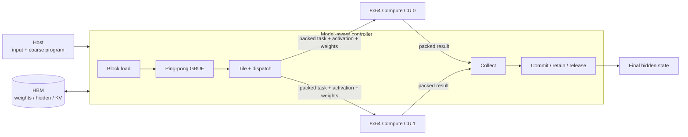
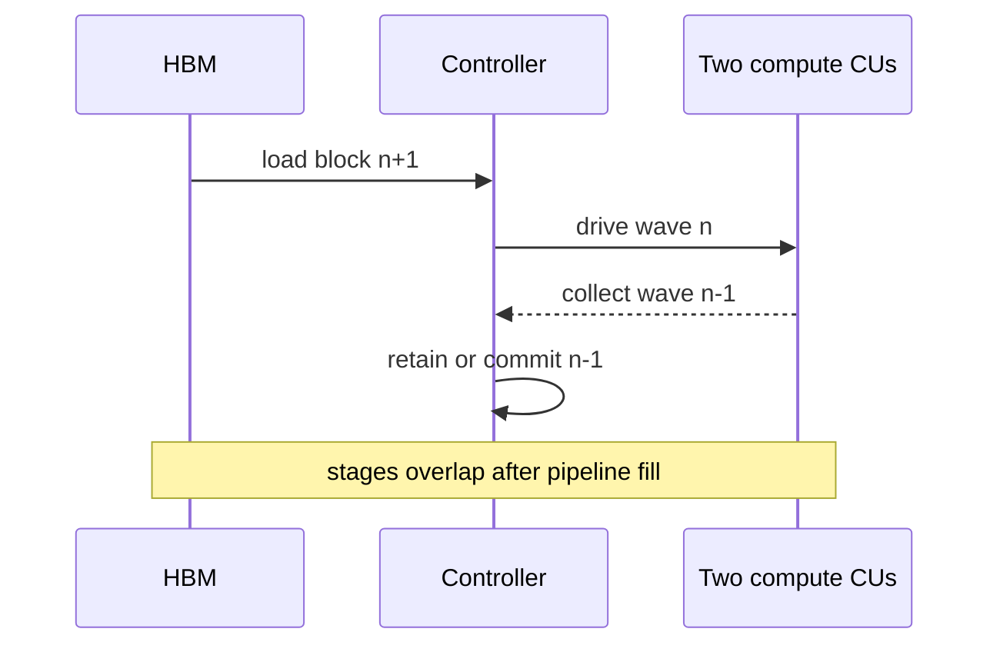

# LLM-ACCEL

**A streaming FPGA research prototype for controller-resident LLM decoder
execution.**

[Architecture](docs/architecture.md) | [Design space](docs/design-space.md) |
[Experiments](docs/experiments.md) | [Setup](docs/environment.md) |
[Reproduction](docs/usage.md) |
[Evidence](results/README.md) | [Citation](#citation) | [License](LICENSE)

LLM-ACCEL investigates how a model-aware controller and regular stream-only
compute arrays can execute transformer decoder subgraphs while keeping hidden
tensors and KV state in accelerator memory. The current fixed-point prototype
implements Qwen-style RMSNorm, Q/K/V/O projections, RoPE, HBM-resident KV,
online attention, gated FFN, and residual paths.

> **Research question.** How much of an LLM decoder can be expressed as a
> static, overlapped hardware schedule while the compute kernels remain simple,
> reusable, and well utilized across prefill and decode shapes?

This repository contains synthesizable HLS kernels, bounded RTL co-simulation,
a Vitis multi-kernel system, deterministic fixed-point oracles, and archived
hardware-emulation evidence. Generated binaries, model weights, and tool build
trees are intentionally excluded.

## Research contributions

- **Model-aware control, regular compute.** The controller owns tensor
  residency, HBM traffic, KV state, online attention, and wave scheduling; two
  identical 8x64 compute CUs execute matrix and vector work.
- **Block-level stream ABI.** Explicit fixed-width packets replace bit-level
  pipelines and cross-XO C++ structs, reducing control fan-out and regularizing
  the physical interface.
- **Five-stage overlap.** Block load, stream drive, compute, collection, and
  commit are connected by bounded FIFOs and cross-wave dataflow.
- **Online attention.** Tiled QK updates a running maximum and normalization
  sum before tiled PV accumulation; the score matrix is never materialized in
  external memory.
- **Controller-resident composition.** Coarse Attention, FFN, and final-norm
  tasks retain hidden state and KV across tasks, query blocks, and layers.
- **Shape-aware evidence.** Prefill and single-row decode use explicit useful
  work, timing-boundary, and active-row definitions rather than conflating
  query-block height with batch size.

## Architecture at a glance


```mermaid
flowchart LR
    H[Host<br/>input + coarse program] --> C
    M[(HBM<br/>weights / hidden / KV)] <--> C

    subgraph C[Model-aware controller]
      direction LR
      L[Block load] --> B[Ping-pong GBUF]
      B --> D[Tile + dispatch]
      R[Collect] --> P[Commit / retain / release]
    end

    D -->|packed task + activation + weights| U0[8x64 Compute CU 0]
    D -->|packed task + activation + weights| U1[8x64 Compute CU 1]
    U0 -->|packed result| R
    U1 -->|packed result| R
    P --> O[Final hidden state]
```

Each compute CU sustains up to 512 MAC/cycle; the two-CU modeled peak is
1,024 MAC/cycle. Compute CUs have no HBM master and encode no model-layer
semantics. The controller presents them with a regular sequence of tiles while
the next block is prefetched:


```mermaid
sequenceDiagram
    participant H as HBM
    participant C as Controller
    participant U as Two compute CUs
    H->>C: load block n+1
    C->>U: drive wave n
    U-->>C: collect wave n-1
    C->>C: retain or commit n-1
    Note over H,U: stages overlap after pipeline fill
```

The production task contract is `Task 18 = Attention`, `Task 19 = FFN`, and
`Task 20 = final RMSNorm`. See the [architecture](docs/architecture.md) for the
memory hierarchy and packet ABI, and the [design-space study](docs/design-space.md)
for alternatives.

## Implementation variants and evidence map

Stable design IDs identify the exact execution boundary behind every root
figure. A dash means that the variant has no root-level performance plot.

| ID and implementation | Execution boundary | Source family | Root figure | Released evidence |
| --- | --- | --- | --- | --- |
| **R1 — Resident coarse-task (current)** | Controller executes Tasks 18/19/20; hidden and KV remain in HBM | [`kernel/`](kernel/), [`host/`](host/) | [R1 overview panels](docs/assets/results-overview.svg) | [P8 resident](results/q214-resident-fix-20260818/), [L1](results/qwen3b-e2e-20260820/), [L2](results/qwen3b-e2e-l2-20260821/) |
| **D1 — Operator-level Q2.14 diagnostic** | Host sequences individual operators; CU intervals measure the diagnostic datapath | R1 kernels with the [`q214exp18` build](scripts/build_vitis_8x64_prefill_eval_hwemu.sh) | — | [P/D 64--1024](results/q214-pd-20260811/) |
| **P1 — Small resident protocol profiles** | Reduced shapes test finite FIFOs, block tails, residency, and controller-owned KV | R1 kernels with small model profiles | — | [Coarse tasks](results/coarse-task-20260816/), [block prefill](results/block-prefill-20260817/) |
| **S1 — Streaming split / V8-2_s** | Earlier control/cache plus fixed compute-core split; analytical full-layer projection only | [`cases/streaming-split/`](cases/streaming-split/) | — | [Design and evidence limits](cases/streaming-split/docs/design.md) |

## Key results

The root highlights only the current R1 mainline. Performance values use Vitis
2022.2 HW-Emu CU traces modeled at 200 MHz; resources are profile-matched HLS
estimates. Neither is a physical-board measurement.


The richest released R1 boundary is P8/G2/L2: one eight-token prompt and one
real D1 forward across two layers and ten coarse tasks. It reaches 119.652
useful GMAC/s and 58.424% modeled efficiency, with 4,096/4,096 oracle values
exact and no intermediate Host hidden-state copy. The highest-utilization
bounded R1 gate is the single-forward P8 Task-18/19/20 path at 189.285 GMAC/s
and 92.424%; it is shown separately because its narrower workload is not an
end-to-end generation request.

From L1 to L2, useful work doubles while modeled cycles increase by 1.948x:
cycles per layer fall 2.60%, throughput rises 2.67%, and efficiency rises
1.520 percentage points. Historical D1/P1/S1 plots, full tables, timing
boundaries, and raw evidence remain in the [experimental report](docs/experiments.md)
and [evidence index](results/README.md). Host compute, PCIe-inclusive latency,
and simulator wall time are excluded from all displayed HW-Emu intervals.

## Evidence ladder

The project separates claims by evidence level:

1. **CSim** checks routing, arithmetic, and reference-model agreement quickly.
2. **RTL CoSim** exercises finite FIFOs with deadlock detection enabled.
3. **HLS CSynth** reports operator schedules and pre-route resource/timing
   estimates.
4. **Vitis HW Emu** validates linked multi-kernel execution and provides the CU
   traces used for the figures above.
5. **Physical implementation and board measurements** remain a separate gate.

Every published result package records its workload, timed boundary, source
snapshot, artifact identities, raw evidence, and checksums. The
[evidence index](results/README.md) states exactly which claim each package
supports.

## Reproduce the core validation

The reference environment is Ubuntu 20.04 with Vitis, Vivado, Vitis HLS, and
XRT 2022.2. The smallest useful validation path is:

```bash
# Resolve the reference toolchain and verify HLS/Host prerequisites first.
source scripts/setup_environment.sh
scripts/check_environment.sh hls

# Fixed-point packet semantics.
make test_q214_payload_golden

# Closed controller-compute loop with finite-FIFO deadlock checking.
make hls_csim_closed_loop_8x64_resident_layer
scripts/run_hls_resident_layer_cosim.sh

# Non-simulator publication and provenance gates.
make test_publication_release
```

Building the exact multi-kernel image and reproducing the standard P8, P/D,
or P8/G2 experiments requires profile-specific XOs and long-running HW Emu.
Follow [Environment Setup](docs/environment.md), then
[Usage and Reproduction](docs/usage.md), rather than copying commands from an
archived result.

## Repository guide

- [`docs/`](docs/README.md) — reading paths for architecture, design choices,
  environment setup, experiments, and reproduction.
- [`kernel/`](kernel/) and [`include/`](include/) — controller, unified compute,
  status sink, fixed-point types, packet ABI, and pipeline parameters.
- [`host/`](host/) — XRT runtime, deterministic random models, and out-of-band
  CPU golden checks.
- [`tests/`](tests/), [`tcl/`](tcl/), and [`scripts/`](scripts/) — the CSim,
  CoSim, synthesis, HW-Emu, evidence, and release flows.
- [`results/`](results/README.md) — immutable, checksum-protected experimental
  packages; generated build trees and binaries are not stored here.
- [`cases/streaming-split/`](cases/streaming-split/) — an earlier streaming
  split design retained as a comparative architecture.

## Scope and current status

Completed evidence includes finite-buffer RTL CoSim, standard-dimension P8
Attention/FFN/final-norm execution, multi-length P/D diagnostics, and
standard-shape P8/G2 L1 and L2 generation-path gates with controller-owned KV.
The full 36-layer HW-Emu extension is an active experiment and is not reported
as a completed result.

Checkpoint-level accuracy, accelerator-side LM-head/sampling, complete
multi-block standard prompts, post-route frequency/power, PCIe-inclusive
latency, and physical-board performance remain open. Deterministic random
Fix16 evidence validates arithmetic and protocol closure; it does not claim
model quality.

## Citation

If LLM-ACCEL contributes to academic work, cite the repository metadata in
[`CITATION.cff`](CITATION.cff) or use the tag `wang2026llmaccel`:

```bibtex
@software{wang2026llmaccel,
  author       = {Teng Wang},
  title        = {LLM-ACCEL: A Streaming FPGA Research Prototype for Resident LLM Decoder Execution},
  year         = {2026},
  institution  = {High Efficient Intelligent Computing Lab, Suzhou Institute for Advanced Research of USTC, Suzhou, China},
  url          = {https://github.com/TruNcat3/LLM-ACCEL},
  version      = {0.8.0}
}
```

## License

Copyright © 2026 Teng Wang, High Efficient Intelligent Computing Lab, Suzhou
Institute for Advanced Research of USTC, Suzhou, China.

Software is available for noncommercial purposes under the
[PolyForm Noncommercial License 1.0.0](LICENSE). Documentation, figures, and
experimental evidence are licensed under
[CC BY-NC 4.0](LICENSES/CC-BY-NC-4.0.md). Both permit attributed modification
and redistribution for noncommercial purposes. Commercial use requires
separate written permission from the copyright holder. Because of the
noncommercial restriction, this is a source-available research release rather
than an OSI-approved open-source license.
