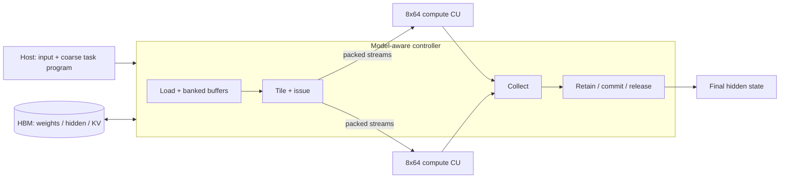

# CoWave (LLM-ACCEL)

**Controller-Orchestrated Streaming for LLM Acceleration.**

Our [Vitis workflow tutorial](https://github.com/Reconfigurable-Computing/Vitis_workflow)
introduces accelerator builds, multi-kernel designs, Host code and Makefiles
with worked examples (in Chinese). For CoWave's Vitis/XRT 2022.2 reference
configuration, continue with [environment setup](docs/environment.md).

[Architecture](docs/architecture.md) | [Implementation map](docs/implementations.md) |
[Design space](docs/design-space.md) | [Experiments](docs/experiments.md) |
[Setup](docs/environment.md) | [Reproduction](docs/usage.md) |
[Citation](#citation) | [License](LICENSE)

CoWave studies how a model-aware controller can schedule regular streaming
compute arrays while keeping transformer hidden tensors and KV state in
accelerator memory. This repository contains a resident decoder implementation,
an alternative streaming split, and quantized matrix experiments, together
with their source, reproduction flows and scoped evidence.

The most complete published system is the **Fix16 resident** implementation.
Fix16 means signed fixed point, not IEEE FP16. Its controller owns RMSNorm,
Q/K/V/O scheduling, RoPE, online attention, KV-cache traffic, gated FFN and
residual execution. Host embedding and vocabulary-head/sampling remain
outside the accelerator.

## Research contributions

- **Model-aware control, regular compute:** a controller expands coarse
  requests into tiles; compute kernels execute reusable matrix/vector tasks.
- **Resident state:** block buffers, hidden-state ping-pong and controller-owned
  KV avoid intermediate Host transfers.
- **Packed streaming and overlap:** fixed-width packets and bounded FIFOs
  support load, issue, compute, collect and commit overlap across projection
  waves.
- **Shape-aware evaluation:** each result identifies precision, active query
  rows, sequence batch, context, timing boundary and evidence level.

The [design-space study](docs/design-space.md) compares implementation choices
for matrix multiplication, vector operators, attention, transport and scheduling.

## Architecture at a glance

The diagram shows the published Fix16 resident system. The other families
explore different compute organization or arithmetic within the same broad
control/compute separation.


```mermaid
flowchart LR
    H[Host: input + coarse task program] --> C
    M[(HBM: weights / hidden / KV)] <--> C
    subgraph C[Model-aware controller]
      L[Load + banked buffers] --> D[Tile + issue]
      R[Collect] --> S[Retain / commit / release]
    end
    D -->|packed streams| U0[8x64 compute CU]
    D -->|packed streams| U1[8x64 compute CU]
    U0 --> R
    U1 --> R
    S --> O[Final hidden state]
```

Two 8×64 arrays provide a logical peak of 1,024 MAC/cycle. Five-stage overlap
applies within a projection across waves; arbitrary transformer operations
remain constrained by data dependencies. The Host submits Attention, FFN and
final-normalization tasks while the controller manages their resident
subgraphs. See [architecture](docs/architecture.md) and the
[runtime contract](docs/coarse-task-runtime.md).

## Implementation map

The three implementation families below organize the public source tree.
The [complete catalog](docs/implementations.md) maps their configurations,
diagnostic workloads and historical names.

| Implementation family | Code location | Published scope |
| --- | --- | --- |
| **Fix16 resident** | [kernel](kernel/), [include](include/), [host](host/) | Resident layer/coarse-task execution; standard-shape L1/L2 HW Emu and scoped diagnostics |
| **Streaming split** | [cases/streaming-split](cases/streaming-split/) | Alternative fixed compute and control/cache split; linear-operation tests and analytical layer projections |
| **Quantized matrix blocks** | [cases/quantized-block](cases/quantized-block/) | W4A4/W8A8 matrix kernels; arithmetic/RTL tests and HLS resource studies |

Implementation profiles, old Case/R1/D1/Q1 labels and source entry points are
mapped in the [catalog](docs/implementations.md). The
[quantized full-layer progress report](docs/quantized-layer-progress.md)
adds completed W4A4 development measurements with replayable trace analysis;
the corresponding full-layer hardware source release is still pending.

## Key results

The figure selects four views of **Fix16 resident**: the most complete released
generation request, a high-utilization bounded workload, layer scaling and
matched resource estimates. They have different workloads and timing scopes.


| Released workload | Modeled result at 200 MHz | Evidence |
| --- | --- | --- |
| P8/G2/L2: one eight-token prompt, one real D1, two layers | 2,319,441.4 cycles; 11.597 ms; 119.652 useful GMAC/s; 58.424% efficiency | [L2 package](results/qwen3b-e2e-l2-20260821/) |
| Standard-shape P8 Attention + FFN + final norm | 651,621 cycles; 3.258 ms; 189.285 useful GMAC/s; 92.424% efficiency | [Resident P8 package](results/q214-resident-fix-20260818/) |

These are HW-Emu CU intervals with Host computation and PCIe outside the timed
boundary. Resources are HLS estimates. Neither row is physical-board throughput
or a measured 36-layer model. The random fixed-point L1/L2 generation gates
check 4,096 values exactly; they do not establish trained-checkpoint accuracy.

The [experiment report](docs/experiments.md) separates current results,
historical baselines, component studies and unresolved numerical questions.
The [evidence index](results/README.md) maps all archived packages to their
implementation and validation scope.

The completed **W4A4 full-layer development comparison** reduces P66+D1
cycles by **14.28%** from its matched baseline; the Integrated
configuration reaches **47.00% Prefill useful-MAC efficiency**. This is a
single-layer HW-Emu measurement with four compute CUs. See the
[comparison and scope](docs/quantized-layer-progress.md) before comparing it
with the Fix16 workloads above.

## Reproduce the core validation

Start with [environment setup](docs/environment.md), then choose a family and
validation level in [usage](docs/usage.md). Reference builds use Vitis/Vivado/
Vitis HLS and XRT 2022.2; the Alveo U50 is the evaluation platform. No physical
card is needed to inspect results or run HLS/RTL hardware emulation.

```bash
git clone https://github.com/TruNcat3/LLM-ACCEL.git
cd LLM-ACCEL

# Inspect the public tree and all archived result checksums.
scripts/check_environment.sh publication
make test_publication_tree
make verify_result_checksums

# With the vendor toolchain installed: prepare HLS/Host validation.
source scripts/setup_environment.sh
scripts/check_environment.sh hls
make test_q214_payload_golden
make hls_csim_closed_loop_8x64_resident_layer
```

CoSim, bounded HW Emu and long model-stack runs have separate
[recipes](docs/usage.md). Choose the workload explicitly; an L36 RTL simulation
is not a quick setup test.

## Repository guide

| Need | Start here |
| --- | --- |
| Get a short overview and a first validation example | [Summary and example](docs/summary-example.md) |
| Learn the Vitis build and runtime flow | [Companion tutorial](https://github.com/Reconfigurable-Computing/Vitis_workflow), then [CoWave setup](docs/environment.md) |
| Understand design choices and alternatives | [Architecture](docs/architecture.md), [design space](docs/design-space.md) |
| Locate implementation files and configuration owners | [Repository map](docs/repository-map.md), [implementation catalog](docs/implementations.md) |
| Build and test a selected family | [Environment](docs/environment.md), [usage](docs/usage.md), [case index](cases/README.md) |
| Interpret a result or compare variants | [Experiments](docs/experiments.md), [immutable evidence](results/README.md) |
| Follow quantized controller and scheduling work | [Full-layer progress](docs/quantized-layer-progress.md) |
| Promote a development change into this repository | [Development-to-release workflow](docs/release-workflow.md) |

The [documentation index](docs/README.md) provides the complete reading order.
Large build trees, binaries, waveforms and model checkpoints are stored outside
the publication tree; compact raw evidence and identity manifests accompany
the reported results.

## Citation

Please cite Teng Wang and this repository using
[`CITATION.cff`](CITATION.cff) or the tag `wang2026llmaccel`:

```bibtex
@software{wang2026llmaccel,
  author       = {Teng Wang},
  title        = {CoWave: Controller-Orchestrated Streaming for LLM Acceleration},
  year         = {2026},
  institution  = {High Efficient Intelligent Computing Lab, Suzhou Institute for Advanced Research of USTC, Suzhou, China},
  email        = {wangt635@ustc.edu.cn},
  url          = {https://github.com/TruNcat3/LLM-ACCEL},
  version      = {0.10.0}
}
```

The citation version identifies the software release, not a hardware profile,
workload or validation level.

## License

Copyright © 2026 Teng Wang, High Efficient Intelligent Computing Lab, Suzhou
Institute for Advanced Research of USTC, Suzhou, China.

Software uses [PolyForm Noncommercial 1.0.0](LICENSE); documentation, figures
and evidence use [CC BY-NC 4.0](LICENSES/CC-BY-NC-4.0.md). Both permit attributed
modification and redistribution for noncommercial purposes. Commercial use
requires separate permission. This is a source-available research release;
the noncommercial restriction is not an OSI-approved open-source license.
