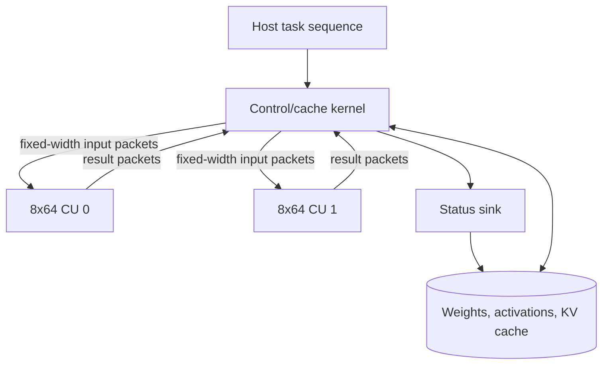
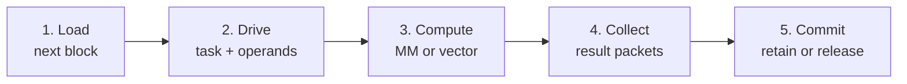
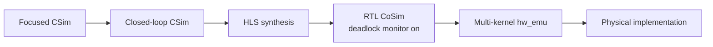

# Architecture

## 1. Design objective

LLM-ACCEL is organized around one constraint: intermediate decoder-layer
tensors should remain on the accelerator whenever their next consumer is also
on the accelerator. The host supplies a high-level operation, addresses, model
parameters, and input data; it is not intended to schedule individual matrix
tiles or manage the KV cache.

This leads to an asymmetric architecture:

- a **model-aware control/cache kernel** owns state and data movement;
- two **model-agnostic compute kernels** execute regular matrix/vector tasks;
- a small **status sink** drains completion messages into host-visible memory.

The standard research profile follows a Qwen-style decoder layer with hidden
size 2048, intermediate size 11008, 16 query heads, 2 KV heads, and head
dimension 128. Arithmetic is fixed point; exact definitions are in
`include/datatypes.hpp` and `include/model_config.hpp`.

## 2. System decomposition

| Component | Count | Responsibility |
| --- | ---: | --- |
| `control_cache_8x64_dual_core_nk` | 1 | Tensor residency, external-memory traffic, model schedule, RoPE, KV cache, online attention, wave dispatch |
| `compute_core_8x64_unified_nk` | 2 | 8x64 matrix engine and shared vector operations |
| `cc8_status_sink_nk` | 1 | Status-stream drainage and host-visible completion record |

The compute kernels expose no external-memory master. Every compute task is
described by streams, which keeps memory-system and model-specific decisions
out of the arithmetic islands.



This partition is also a research boundary. Alternative memory layouts,
attention schedules, and batching policies can be implemented in the
controller without cloning the compute datapath.

## 3. Compute organization

Each compute CU contains an 8-row by 64-column MAC organization:

- 512 MAC/cycle per CU;
- 1024 MAC/cycle for the two-CU system;
- output columns are split across CUs;
- an activation block is broadcast while each CU receives its own weight and
  output-column range.

The array shape intentionally exposes the decode/prefill distinction. A single
decode token activates one of eight rows, whereas an 8-token prefill block can
fill all rows. Consequently, decode results report both full-array utilization
and utilization normalized to the one-row shape limit.

The unified compute task supports matrix multiplication and the vector paths
needed by RMSNorm, residual addition, and gated activation. Model sequencing
remains outside the CU.

## 4. Block-level stream ABI

Cross-kernel interfaces use `ap_uint<W>` packets with explicit packing in
`include/vitis_stream_8x64.hpp`. Custom C++ structs do not cross XO boundaries.

| Channel | Width | Payload |
| --- | ---: | --- |
| task | 160 bits | Operation, shape, wave/repeat information, scaling, and result policy |
| activation | 128 bits | Eight 16-bit token lanes |
| weight | 256 bits | Sixteen 16-bit weight lanes; four streams per CU |
| vector/result | 416 bits | Data plus validity, token, element, and block metadata |
| status | 64 bits | Completion state and task/wave/packet counters |

The regular packet boundary replaces an earlier fine-grained control style.
It reduces cross-kernel control networks, but it does not by itself solve
internal reduction dependencies, fan-out, or placement congestion. Timing and
routing must therefore be assessed separately from interface width.

## 5. Controller memory hierarchy

The controller operates at two granularities:

1. **block granularity** for external-memory transfer and on-chip residency;
2. **8x64 wave granularity** for compute dispatch.

Large feature buffers keep the token dimension explicit as
`buffer.block[token][block]`. This is a synthesis requirement, not merely a
coding preference: flattening a completely partitioned two-dimensional GBUF
through a pointer passed C simulation but did not preserve all token rows in
RTL. Typed buffer access is now part of the correctness contract.

Weight data is read as 512-bit blocks and converted into regular 256-bit row
packets. The selected producer rate is II=2. Eight output slots are interleaved,
so a slot receives a block every 16 cycles, exactly matching the 16-cycle
consumer schedule. Raising the producer to II=1 would only increase queued
state for the current consumer rate.

## 6. Five-stage cross-wave pipeline

The intended layer schedule overlaps five logical stages:



At steady state, stages operate on different waves. The selected configuration
uses:

```text
CC8_WEIGHT_TILE_FIFO_DEPTH=2
CC8_WEIGHT_TILE_LOAD_II=2
CC8_MM_WAVE_RESULT_FIFO_DEPTH=33
CC8_ENABLE_MM_CROSS_WAVE_DATAFLOW=1
```

FIFO depth is treated as a rate-matching parameter. Larger depths are not
automatically better: they cost storage, enlarge backpressure networks, and can
worsen placement. Every change to stream depth or stage overlap is required to
pass closed-loop RTL CoSim with deadlock detection enabled.

## 7. Coarse-task execution model

The intended runtime boundary is deliberately between two extremes. The host
does not submit matrix tiles, but the controller is also not required to run
an entire model from one command. The host composes a sequence of coarse
compute tasks; each task expands inside the controller into a static resident
subgraph.

| Host-visible task | Controller-resident subgraph | Persistent state |
| --- | --- | --- |
| Attention sublayer | RMSNorm, Q/K/V, RoPE, KV append/read, tiled online attention, O projection, residual | hidden handle, layer/position, KV length and cache addresses |
| FFN sublayer | RMSNorm, Gate/Up, SiLU multiply, Down, residual | input/output residency and ping-pong GBUF selection |
| Finalize/output | Commit selected hidden block and status | output address, checksum/counters |

This task granularity supports host-level composition across layers, requests,
and sampling policy while keeping PCIe out of intermediate-tensor and KV-cache
traffic. Task descriptors carry tensor addresses/handles and shape metadata;
controller status records completion and the next valid residency state.

The published Q2.14 profile still uses the host to invoke individual operators
for visibility and golden checking. Converting that diagnostic path into the
coarse tasks above is the next implementation stage, not a property claimed by
the current performance table.

### Resident subgraph schedule

A controller layer task expands into a static sequence:

```text
attention RMSNorm
  -> Q/K/V projections
  -> RoPE
  -> KV append/read
  -> QK tiles
  -> online normalization and PV accumulation
  -> O projection
  -> attention residual
  -> FFN RMSNorm
  -> Gate and Up projections
  -> SiLU multiply
  -> Down projection
  -> FFN residual
```

Each result has an explicit policy: commit to external memory, retain in the
GBUF for a following operator, or release. A coarse task therefore does not
require host round trips between operators inside its subgraph. The host may
submit the following coarse task using the resident output handle rather than
copying the tensor through host memory.

## 8. Online attention and KV-cache ownership

The KV cache belongs to the controller and resides in external accelerator
memory. Sending it through host memory for every token would put PCIe latency
in the decode loop and break the resident execution model.

Attention is evaluated tile by tile. For each query group, the controller
maintains:

- the running score maximum;
- the rescaled normalization sum;
- the rescaled PV accumulator.

When a new tile arrives, previous state is rescaled and merged. This avoids
materializing the full attention-score matrix and allows the same mechanism to
continue across cache tiles. QK/PV arithmetic is delegated to the compute CUs;
normalization state and cache addressing remain in the controller.

## 9. Correctness and evidence hierarchy



Each level answers a different question:

- CSim checks algorithms and packet semantics.
- Closed-loop RTL CoSim checks finite-depth feedback and progress.
- HLS synthesis checks timing estimates, II, and resource structure.
- Hardware emulation checks exported XO interfaces, system connectivity, XRT
  scheduling, and simulated active cycles.
- Physical implementation is required for final frequency, power, and board
  throughput claims.

Current evidence is summarized in [Experiments](experiments.md).

## 10. Case studies

The repository contains two architecture cases that share the
model-aware-control + model-agnostic-compute principle but differ in
their concrete realization:

### Case 1: Resident closed-loop (default)

The primary prototype (`kernel/control_cache_8x64.cpp` +
`kernel/compute_core_8x64_unified.cpp`) implements a fully resident
Qwen decoder layer with online attention, RoPE, KV cache, and a
status-sink completion drain. Two 8×64 compute CUs (1024 MAC/cycle peak)
are connected to the controller through fixed-width stream packets.
The controller owns all HBM traffic and model state.

See [Usage](usage.md) for build and validation instructions.

### Case 2: Streaming split (cc + V8-2_s)

A **separated streaming architecture** (`cases/streaming-split/`)
where a lightweight dataflow orchestrator (`control_cache_core`) drives
a single fixed compute core (`V8-2_s`) through an `operator_program`
schedule. Key differences from Case 1:

| Aspect | Case 1 (resident) | Case 2 (streaming-split) |
| --- | --- | --- |
| Compute CUs | 2 × 8×64 (1024 MAC/cyc) | 1 × V8-2_s (2048 DSP) |
| INPUT_DIM | 4 | **16** (reduction depth 4×) |
| Weight ports | 1 m_axi | **4 m_axi** (HBM[2:5], 3.67× bandwidth) |
| I/O width | 128-bit input | **512-bit** packed input/output |
| Controller style | Resident loop (attention/KV inline) | **Dataflow DAG** (dispatch→input/output_path) |
| Schedule | Hardcoded layer loop | **operator_program** (flat uint32, reconfigurable) |
| Accumulate | Internal wave scheduling | **op_program accumulate sequence** (caller-driven) |
| Decode throughput | ~11 token/s (est.) | **~50 token/s** (csynth est.) |

Case 2 demonstrates that a **fixed compute core** can serve arbitrary LLM
dimensions through operator-program scheduling, achieving ~7× speedup over
the original D=4 single-stream configuration through three orthogonal
optimizations: INPUT_DIM 4→16 (reduction depth), weight 4-PC multi-bank
(load bandwidth), and streaming compute (eliminating local buffer port
conflicts).

See [`cases/streaming-split/docs/design.md`](../cases/streaming-split/docs/design.md)
for the detailed design document.
