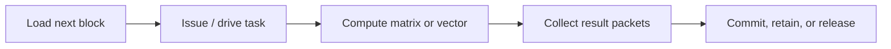
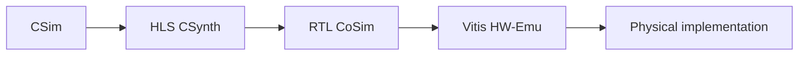

# Architecture

[Documentation index](README.md) | [Implementation map](implementations.md) |
[Repository map](repository-map.md) | [Design space](design-space.md) |
[Experiments](experiments.md) | [Setup](environment.md) |
[Repository](../README.md)

This is the stable architecture description for the public repository. CoWave
has one shared design idea and three real implementation families. The shared
idea is model-aware control around regular stream compute with explicit packet
boundaries and bounded buffering. The families below are different source and
runtime boundaries, not successive names for one accelerator generation.

## 1. Design objective

Intermediate decoder-layer tensors should remain on the accelerator whenever
their next consumer is also on the accelerator. The host supplies high-level
work, addresses, model parameters, and input data; it is not intended to issue
individual matrix tiles or manage the KV cache in the resident family.

The common architectural split is:

- a control or cache component owns scheduling and data movement;
- regular compute components consume fixed-width streams and do not own model
  semantics or external-memory policy;
- bounded FIFOs make backpressure and progress testable at the interfaces.

## 2. System decomposition

The public families and their actual boundaries are:

| Family | Source boundary | Numeric representation verified in source | Public evidence status |
| --- | --- | --- | --- |
| **Fix16 resident** | Root `kernel/`, `include/`, and `host/`: controller/cache kernel, two unified 8x64 compute CUs, and status sink | `fm_t=ap_fixed<16,8>`, `wt_linear_t=ap_fixed<16,4>`, `fm_accum_t=ap_fixed<32,16>`, and Q2.14 `attention_prob_t=ap_fixed<16,2>` | CSim, finite-buffer RTL CoSim, HLS CSynth, and bounded Vitis HW-Emu packages. See [coarse-task runtime](coarse-task-runtime.md), [experiments](experiments.md), and [published evidence](../results/README.md). |
| **Streaming split** | `cases/streaming-split/`: `control_cache_core` (`cc`) plus the fixed V8-2_s compute core | Fixed-point payloads and accumulators (`ap_fixed<16,8>`, `<16,4>`, `<32,16>`, and internal `<48,24>`); normalization uses `hls::recip` after a float conversion, so this is not an end-to-end Fix16-equivalent path | Case-local CSim/sw_emu, HLS estimates, and bounded emulation checks are documented. Full-layer throughput remains an analytical projection, not a public end-to-end measurement. |
| **Quantized matrix blocks** | `cases/quantized-block/`: isolated controller-facing W4A4 and W8A8 matrix blocks | Signed integer operands (`ap_int<4>` or `ap_int<8>`), internal 20/28-bit accumulators, and 24/32-bit output words; task scale fields are carried but not applied in these probes | CSim, deadlock-enabled RTL CoSim, and isolated HLS CSynth/resource evidence. No controller-integrated full layer, routed link, HW-Emu, or board claim is released. |

The descriptive names, legacy aliases, workload axes, and evidence-stage rules
are maintained in the [public implementation map](implementations.md). The
repository-level ownership and navigation map is in the
[repository map](repository-map.md).

## 3. Compute organization

### Fix16 resident

The selected root datapath has two 8-row by 64-column compute CUs. Each CU can
issue up to 512 MAC/cycle, for a modeled two-CU peak of 1,024 MAC/cycle. The
controller broadcasts activation blocks, partitions output columns, and keeps
HBM traffic and model-layer sequencing outside the compute CUs. One decode row
therefore exposes a shape limit: it cannot fill all eight token rows without
independent requests or another row-mapping policy.

The unified CU also provides the vector paths used by RMSNorm, residual
addition, and gated activation. RoPE, online attention, KV addressing, and
coarse-task sequencing remain controller responsibilities.

### Streaming split

The case-local V8-2_s core has two cores, one lane per core, a 16-input by
64-output matmul tile, and 2,048 modeled DSP lanes. The `cc` component scales
larger projections by issuing a sequence of operations through its
`operator_program`; the fixed compute core is not regenerated for each model
projection. This is a separate architecture, not a second profile of the root
resident controller.

### Quantized matrix blocks

The W4A4 block is an 8x64 logical tile with four products recovered per DSP.
The W8A8 block is a 4x128 tile with one INT8 product per DSP. Both are bounded
stream kernels. Their four-CU resource sums are planning candidates, not a
completed multi-kernel implementation.

## 4. Block-level stream ABI

All three families make packet boundaries explicit, but their ABIs are not
interchangeable:

| Family | Packet boundary | Important contract |
| --- | --- | --- |
| Fix16 resident | 160-bit task, 128-bit activation, 256-bit weight, 416-bit vector/result, 64-bit status packets | `ap_uint<W>` packing crosses XO boundaries; compute CUs have no HBM master |
| Streaming split | 512-bit input and weight AXI packets, two 1,024-bit output halves, and a 32-bit control packet | Output metadata is implicit in packet order; four weight streams map to HBM[2:5] |
| Quantized matrix blocks | 128-bit task word, 32-bit activation, 256-bit weight, and 448-bit W4A4 or 576-bit W8A8 output words | Scale fields and block metadata are transported, but scale application and controller accumulation remain open |

The regular packet boundary reduces cross-kernel control fan-out. It does not
solve arithmetic reduction dependencies, placement congestion, or the need to
prove a finite-buffer progress contract for each family.

## 5. Controller memory hierarchy

The Fix16 resident controller operates at block granularity for HBM transfer
and residency, then at 8x64 wave granularity for compute dispatch. Hidden state
uses two HBM feature-buffer pairs. Task 18 writes one pair, Task 19 consumes it
and writes the other, and the next layer consumes that result directly. The KV
cache, RoPE table, and normalization state stay controller-owned.

The Host builds a static descriptor array containing operation, layer, position,
active query rows, and HBM pair IDs. It does not place raw KV or controller-local
intermediate addresses in a descriptor. Detailed fields, continuity checks,
task counts, and measurement boundaries belong in the
[controller-resident runtime report](coarse-task-runtime.md), not in this
architecture summary.

The streaming split has a different memory boundary: `cc` reads hidden input,
weights, and operation descriptors, then streams packed operands to V8-2_s and
stores packed output. It is an operator-program dataflow design, not the
resident Task 18/19/20 runtime. Quantized blocks expose controller-facing
streams only; they do not own HBM or a model-level cache.

## 6. Five-stage cross-wave pipeline

Within the Fix16 resident projection path, the tested schedule overlaps five
logical stages on different waves:


```mermaid
flowchart LR
    L[Load next block] --> I[Issue / drive task]
    I --> C[Compute matrix or vector]
    C --> R[Collect result packets]
    R --> M[Commit, retain, or release]
```

The relevant invariant is **load -> issue -> compute -> collect -> commit** for
different waves of one intra-projection schedule. The release configuration
uses:

```text
CC8_WEIGHT_TILE_FIFO_DEPTH=2
CC8_WEIGHT_TILE_LOAD_II=2
CC8_MM_WAVE_RESULT_FIFO_DEPTH=33
CC8_ENABLE_MM_CROSS_WAVE_DATAFLOW=1
```

These settings are rate-matching parameters, not a promise that arbitrary
prompt blocks overlap. Prompt blocks and decode descriptors remain ordered by
the Host task program; cross-block residency and finite-stream completion are
separate evidence scopes. Every depth or overlap change must pass closed-loop
RTL CoSim with deadlock detection.

The streaming split overlaps dispatch, input movement, compute, and output
collection in its own three-process `cc` dataflow graph. That graph should not
be read as proof of the Fix16 resident five-stage contract or of generalized
cross-block overlap.

## 7. Coarse-task execution model

Only the Fix16 resident family currently exposes the production coarse-task
contract:

| Task | Host-visible operation | Controller-resident work |
| ---: | --- | --- |
| 18 | Attention sublayer | RMSNorm, Q/K/V, RoPE, KV append/read, tiled online attention, O projection, residual |
| 19 | FFN sublayer | RMSNorm, Gate/Up, SiLU multiply, Down projection, residual |
| 20 | Final RMSNorm | Model-level normalization after the final decoder layer |

Operator diagnostics and small-shape protocol tests exercise narrower evidence
scopes of this Fix16 family. They are not implementation generations. The
static descriptor executor, HBM-pair continuity, block composition, and released
workload tables are maintained in [coarse-task-runtime.md](coarse-task-runtime.md)
and [experiments.md](experiments.md).

## 8. Online attention and KV-cache ownership

The Fix16 resident controller keeps KV in accelerator memory and evaluates
attention tile by tile. It maintains the running score maximum, rescaled
normalization sum, and rescaled PV accumulator; the score matrix is not
materialized in external memory. QK/PV arithmetic is delegated to the compute
CUs while cache addressing and normalization state remain in the controller.

The Q2.14 operator diagnostic exercises this arithmetic boundary with a
host-orchestrated layer profile. It does not change the ownership model of the
resident family. The streaming split and quantized matrix-block families do not
publish this same controller-owned online-attention implementation.

## 9. Correctness and evidence hierarchy

Evidence stages answer different questions:


```mermaid
flowchart LR
    A[CSim] --> B[HLS CSynth]
    B --> C[RTL CoSim]
    C --> D[Vitis HW-Emu]
    D --> E[Physical implementation]
```

- CSim checks arithmetic, routing, and packet semantics.
- RTL CoSim checks finite FIFOs, feedback, and deadlock-free progress for the
  tested bounds.
- HLS CSynth reports local II, resource, and timing estimates; it is not
  place-and-route closure.
- Vitis HW-Emu checks linked multi-kernel execution and modeled CU intervals;
  it is not physical-board timing, power, or throughput.
- Physical implementation is a separate gate for routing, frequency, power,
  and board measurements.

Use [experiments.md](experiments.md) and the [published evidence index](../results/README.md)
for measured scopes. Use the [Streaming split](../cases/streaming-split/docs/design.md)
and [Quantized matrix blocks](../cases/quantized-block/README.md) case documents
for their family-specific evidence boundaries.

## 10. Family documents

The root source tree is the **Fix16 resident** family. The
[Streaming split](../cases/streaming-split/README.md) and
[Quantized matrix blocks](../cases/quantized-block/README.md) directories are
independent implementation families with their own source and reproduction
contracts. Their analytical projections, isolated kernels, and resource plans
must not be promoted to the resident family's released end-to-end evidence.
