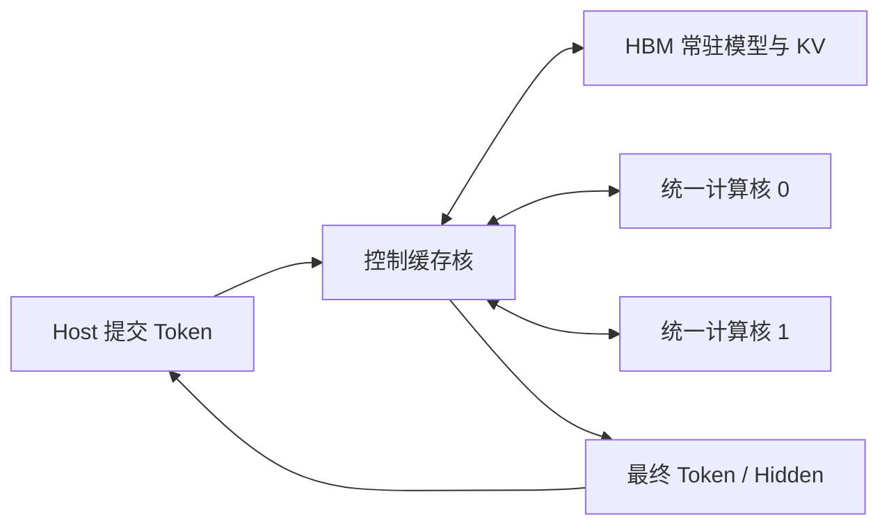

# 双 8x64 统一计算核架构

## 1. 系统目标

该设计面向 Xilinx Alveo U50，将模型语义集中在控制兼缓存核中，把计算核约束为
可复用的纯计算服务。HLS 只分别验证小核心；完整连接、HBM 映射和多核调度由
Vitis 完成。

系统包含四个 kernel 实例：

```text
                         +----------------------+
HBM[0:19] <------------> | 控制兼缓存核 cc8_ctrl |
                         +----------+-----------+
                                    |
                   task / activation / weight / vector
                             AXI4-Stream
                         +----------+-----------+
                         |                      |
                 +-------v-------+      +-------v-------+
                 | 统一计算核 0   |      | 统一计算核 1   |
                 | 8x64 MM + NL  |      | 8x64 MM + NL  |
                 +-------+-------+      +-------+-------+
                         |                      |
                         +----------+-----------+
                                    |
                         result AXI4-Stream
                                    |
                              +-----v-----+
                              | 状态回收核 |
                              +-----------+
```

## 2. 统一计算核

### 2.1 8x64 MM 引擎

单个计算核每拍接收：

- 8 个 activation，分别对应 8 个 token；
- 4 路 16-lane weight packet，共 64 个输出权重。

每拍完成 `8 x 64 = 512` 个定点 MAC。K 维在时间上展开，权重在 8 个 token
之间复用，activation 在 64 个输出之间广播。两个计算核并行时，一个 wave
覆盖 `8 tokens x 128 outputs`。

主循环使用 DSP48 fused multiply-add。MM 结果以 16-lane packet 输出，每个
8x64 block 产生 32 个 packet。

### 2.2 纯计算模式

计算核不理解 Q、K、V、FFN 或 Qwen layer，只接受以下数值模式：

| 模式 | 含义 |
| --- | --- |
| `MM` | 矩阵乘 |
| `MM_SILU` | MM 后执行 SiLU |
| `MM_SCALE` | MM 后乘数值 scale |
| `SILU` | 向量 SiLU |
| `SILU_MUL` | 两路向量执行 `SiLU(a) * b` |
| `RMSNORM` | RMSNorm |
| `RESIDUAL_ADD` | 两路向量相加 |
| `SOFTMAX` | 分行 softmax |
| `STOP` | 结束本次 kernel 调用 |

非线性单元不与 512-MAC 阵列等比例展开。SiLU、倒数、平方根倒数和指数使用低
并行度流水近似，以 block 时间覆盖为目标。

### 2.3 Stream ABI

HLS 内部使用 typed struct；跨 XO 的 Vitis `stream_connect` 使用固定宽度
`ap_uint`，由 NK wrapper 显式打包和解包：

| 数据 | 宽度 |
| --- | ---: |
| task | 352 bit |
| activation | 128 bit |
| weight | 256 bit |
| vector/result | 416 bit |
| status | 256 bit |

该约束避免 Vitis link 无法共享 C++ struct 声明，也避免未使用 stream 被推断为
错误方向。

## 3. 控制兼缓存核

控制核负责：

- 解释 projection、FFN、attention 和向量算子；
- 从 HBM 读取输入、辅助张量和 16 路权重 shard；
- 管理片上 global buffer；
- 把模型算子翻译为统一计算核 task；
- 向两个计算核发送数据并回收结果；
- 将结果写回 HBM，并发送完成状态。

### 3.1 算子映射

| 模型算子 | 计算核任务 |
| --- | --- |
| Q/K/V/O projection | `MM` |
| FFN Gate/Up/Down | `MM` 或 `MM_SILU` |
| Attention QK | `MM_SCALE` |
| Attention PV | `MM` |
| RMSNorm | `RMSNORM` |
| SiLU-Mul | `SILU_MUL` |
| Residual | `RESIDUAL_ADD` |
| Softmax tile | `SOFTMAX` |

QK 映射为 `A[8 heads][HEAD_DIM] x K^T[HEAD_DIM][64 positions]`。PV 映射为
`P[8 heads][tile_len] x V[tile_len][64 head dims]`，因此两者都能复用 8x64
MM 引擎。

### 3.2 HBM 与端口

所有片外数据口都是 512 bit，计算核不直接连接 HBM：

- HBM[0:1]：输入与输出 feature；
- HBM[2:3]：辅助输入、attention panel 和低并发共享数据；
- HBM[4:19]：16 路权重 shard；
- 状态核与低流量数据共享 HBM[3]。

总计使用 20 个 U50 HBM pseudo-channel，低于 XRT 可用的 28 个端口。

### 3.3 缓存与流水

外部按双 global buffer 组织 load、compute、store：

1. 首块装入 GBUF0；
2. 下一块装入 GBUF1，同时计算 GBUF0；
3. 后续阶段交替执行 load、compute、store；
4. 排空最后的 compute；
5. 排空最后的 store。

计算核内部按“局部装载、MM、结果回写”三级运行。控制核在 global buffer
边界完成转置、分区和语义消除，计算核只处理规整 packet。

## 4. Host 调度

XRT host 使用四条 command queue 并发启动：

- 控制缓存核；
- 两个统一计算核；
- 状态回收核。

smoke host 验证接口、权重分片和基本算子。模型级 host 实现 decoder layer
调度、RoPE、KV cache、跨 attention tile 的全局 softmax、最终 RMSNorm 和
host LM head，并支持零权重与随机定点数测试。

## 5. 物理设计原则

### 5.1 Block 边界

模块之间传递当前计算阶段真正需要的 packet，不传递超宽聚合对象。block
pipeline 应在数据重排完成后建立明确的寄存器或 FIFO 边界，以缩短组合路径并
控制扇出。

### 5.2 数据复用

MM 引擎采用 B 复用导向：

- 同一组权重在 8 个 token 间复用；
- 同一 activation 在 64 个输出间广播；
- K 维按时间展开；
- accumulator 在核心内部保存，完成 block 后再输出。

该组织方式把片上带宽集中在规则的 activation 和 weight packet，避免为每个
MAC 单独提供数据。

### 5.3 存储语义

HBM 只连接控制缓存核。控制核在写入 global buffer 时完成转置、分区和格式
转换；计算核不解释模型布局，也不直接处理 HBM 端口。

片上数组是否分区、使用 BRAM 还是寄存器，应由实际读写并行度决定。完全分区只
用于每拍确实需要并行访问的维度。

### 5.4 跨核接口

跨 XO 接口必须使用固定宽度 `ap_uint`。宽 stream 在进入物理实现前应拆成稳定
packet，并在可能跨 SLR 的路径上保留插入 register slice 的位置。

## 6. 未来任务：设备驻留式整网

### 6.1 目标

Host 只负责：

- 装载模型；
- 提交 token、position 和运行参数；
- 读取最终 hidden state 或生成 token。

Embedding 之后的 decoder 计算、中间激活和 KV 状态全部保留在 FPGA/HBM 内，
由控制缓存核持续调度两个统一计算核。

### 6.2 控制任务

新增面向控制核的宏任务，例如：

- `DECODER_TOKEN`：完成一个 token 的全部 layer；
- `DECODER_LAYER`：完成指定 layer；
- `ATTENTION_CONTEXT`：完成多 tile attention；
- `LM_HEAD_ARGMAX`：完成分块 LM head 和规约。

这些是控制层任务。统一计算核仍只接受 MM、Norm、Softmax 和向量类纯计算语义。

### 6.3 HBM 常驻区

控制核需要统一管理：

- 当前 hidden state 和 residual；
- Q/K/V 临时张量；
- 持久化 KV cache；
- attention score、max、sum 和 weighted-sum；
- FFN 中间张量；
- norm、RoPE 和 LM head 参数。

不同阶段不并发使用的张量应复用同一 scratch 区，减少 HBM 端口和容量压力。

### 6.4 需要补全的计算路径

- 将 RoPE 降低为小 MM/elementwise task，或增加共享旋转 primitive；
- 使用在线 max/sum/weighted-sum 支持跨 tile softmax；
- 由控制核直接生成 KV panel 地址；
- 使用现有 MM 引擎分块执行 LM head；
- 增加 argmax reduction，避免把完整 logits 写回 Host。

### 6.5 目标数据流



该任务主要扩展控制、缓存和 task lowering，不改变双 8x64 计算阵列的基本结构。
