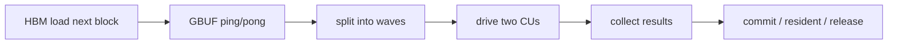
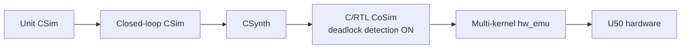

# 双 8×64 resident decoder 架构

## 1. 设计目标

设计面向 Qwen 类 decoder-only 模型的 token 计算。Host 只负责准备模型与输入、下发一次高层操作并读取最终结果；高频调度、权重搬运、RoPE、KV Cache 和 attention 不跨 PCIe 往返。

当前标准层采用 Qwen2.5-3B 形状：hidden size 2048、intermediate size 11008、16 个 query head、2 个 KV head、head dimension 128。计算数据采用定点格式，具体宽度由 `model_config.hpp` 和 `datatypes.hpp` 定义。

## 2. Kernel 划分

系统包含四个 Vitis compute unit：

| 实例 | 数量 | 责任 |
| --- | ---: | --- |
| `control_cache_8x64_dual_core_nk` | 1 | HBM、片上缓存、模型状态机、分波调度、RoPE、KV、在线 Softmax |
| `compute_core_8x64_unified_nk` | 2 | 8×64 MM、RMSNorm、SiLU-Mul、Residual、向量/attention 辅助通路 |
| `cc8_status_sink_nk` | 1 | 消费完成状态并写入 host 可见 HBM，避免状态 stream 反压 |

计算核没有 AXI memory master，保持为纯 stream 计算岛。控制核是唯一的数据编排者，因而可以在设备侧管理 KV Cache，并避免 token decode 被 PCIe 带宽和启动延迟限制。

## 3. 块级 stream ABI

跨 XO 边界不传递 C++ struct，而是显式 pack/unpack 为 `ap_uint<W>`：

| 通道 | 位宽 | 说明 |
| --- | ---: | --- |
| task | 160 bit | 模式、策略、形状、wave/repeat 和缩放参数的紧凑编码 |
| activation | 128 bit | 8 个 16-bit token lane |
| weight | 256 bit | 16 个 16-bit 权重 lane；每 CU 四路并行 |
| vector/result | 416 bit | 256-bit 数据加有效掩码、token、元素和 block 元数据 |
| status | 64 bit | 操作、完成状态、wave/task/packet 计数 |

早期逐字段/按位逻辑会形成大量跨 kernel 控制网络。当前块级接口显著减少 task/status 控制宽度，并让物理实现看到规则的总线，但它只改善 kernel 边界；kernel 内部的归约、在线 Softmax、跨 SLR 扇出和拥塞仍可能成为时序关键路径。

## 4. 控制核数据流

矩阵任务以大块为缓存粒度，以 8×64 tile 为计算粒度：



`CC8_ENABLE_MM_CROSS_WAVE_DATAFLOW=1` 时，控制核用独立 scratch 和 FIFO 将以下阶段并行化：

1. 从 HBM 装载下一 weight tile；
2. 向计算核发送 task、activation 和 weight；
3. 计算核执行 MM/向量操作；
4. 收集当前 wave；
5. 将结果写回 HBM或保留在片上供下一算子使用。

当前推荐超参：weight tile FIFO depth 2、load II 2、wave result FIFO depth 33。深度不是越大越好：足以吸收生产者/消费者抖动即可，更深 FIFO 会增加 BRAM/FF、布线距离和反压网络。任何深度调整都必须使用开启死锁检测的 RTL CoSim 验证。

## 5. Resident decoder layer

一次 layer 操作由控制核静态拆解为：

```text
RMSNorm
  -> Q/K/V projection
  -> RoPE
  -> append/read KV Cache
  -> tiled QK
  -> online Softmax state update
  -> tiled PV
  -> O projection + residual
  -> RMSNorm
  -> Gate/Up projection
  -> SiLU-Mul
  -> Down projection + residual
```

中间 tensor 根据 result policy 选择写回、驻留或释放。Attention 使用按 tile 更新的 running maximum、normalization sum 和 PV accumulator，避免生成完整 score matrix；KV K/V 分别映射到 HBM，并由 position/context 参数决定追加和读取范围。

单 token decode 的 8×64 阵列只有一行有效，因此“针对有效 shape 的利用率”和“两 CU 全物理峰值利用率”必须分开报告。后续提升 decode 物理利用率的方向是 Split-M/多请求并行：广播同一 input，由两个 CU 处理不同输出列，而不是增加 controller 的动态调度复杂度。

## 6. HBM 映射

`conn_u50_8x64_dual.cfg` 用于当前 qwen-layer 实验：

- HBM[0:3]：输入、输出、辅助数据和 status；
- HBM[4:19]：16 路权重 shard；
- HBM[20:21]：K/V Cache。

单个 U50 HBM pseudo-channel 约 256 MiB。完整 3B 权重不能假设每个 shard 永远装入单一 pseudo-channel，因此 `conn_u50_8x64_dual_full_resident.cfg` 为每对 shard 分配跨三个 HBM bank 的地址范围，并将数据与 KV 放到剩余 bank。该映射是容量设计入口，仍需真实完整权重与板卡验证。

## 7. 验证层次



- 单元 CSim 检查 pack/unpack、RoPE bank、probability buffer 和数值边界。
- 闭环 CoSim 同时实例化 controller 与 compute 数据通路，验证有限 FIFO 下不会阻塞。
- hw_emu 检查 XO ABI、kernel 连接、HBM 映射、XRT 调度和系统周期。
- 板上测试才用于最终频率、吞吐、功耗和稳定性结论。

当前测量与验证边界见 [当前版本与验证](当前版本与验证.md)。
